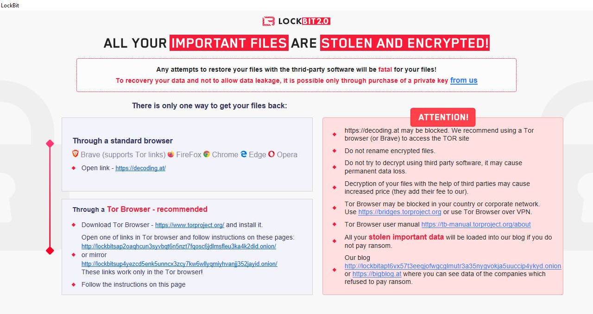

# Bank of America Cyber Risk Assessment Report

## A Look Into Potential Threats

Bank of America (BoA) is one of the largest multinational financial institutions, serving approximately 69 million clients across more than 35 countries. Its extensive operations and global reach make it a critical player in the financial sector, but also expose it to a wide array of cyber and operational risks. As a major custodian of sensitive financial and personal data, BoA faces persistent threats from cybercriminals, state actors, and insider threats, as well as risks stemming from its reliance on third-party service providers.

## Previous Attacks

Bank of America has experienced several significant data breaches in recent years, most of which have involved third-party vendors:

- **2023 LockBit Ransomware Attack:** On November 3, 2023, the LockBit ransomware group compromised Infosys McCamish Systems (IMS), a third-party provider managing deferred compensation plans for BoA. This breach exposed the personal data of 57,028 clients, including names, addresses, dates of birth, Social Security numbers, business emails, and account information [1](https://www.strongdm.com/what-is/bank-of-america-data-breach),[2](https://www.twingate.com/blog/tips/Bank%20of%20America-data-breach),[3](https://panorays.com/blog/boa-data-breach-2024/),[4](https://onerep.com/blog/bank-of-america-data-breach-what-to-know). The breach highlighted the risks associated with third-party vendors and the need for robust supply chain security.

- **2024 Document Mishandling Incident:** On December 30, 2024, a third-party document destruction vendor failed to secure confidential paper documents during transport. Some documents were found outside secure containers, potentially exposing sensitive customer information such as names, Social Security numbers, account details, and contact information. This incident affected at least two customers directly but raised concerns about broader exposure and third-party risk management [5](https://dailysecurityreview.com/security-spotlight/bank-of-america-issues-warning-on-data-breach-millions-of-accounts-at-risk/),[4](https://onerep.com/blog/bank-of-america-data-breach-what-to-know).

- **2025 Third-Party Security Failure:** In January 2025, another third-party security lapse led to the compromise of data from at least 414 customers, again underscoring the recurring nature of third-party-related incidents [5](https://dailysecurityreview.com/security-spotlight/bank-of-america-issues-warning-on-data-breach-millions-of-accounts-at-risk/),[4](https://onerep.com/blog/bank-of-america-data-breach-what-to-know).

Bank of America's responses to these incidents have included offering affected customers complimentary identity theft protection services and enhancing monitoring for suspicious activity [2](https://www.twingate.com/blog/tips/Bank%20of%20America-data-breach),[5](https://dailysecurityreview.com/security-spotlight/bank-of-america-issues-warning-on-data-breach-millions-of-accounts-at-risk/),[4](https://onerep.com/blog/bank-of-america-data-breach-what-to-know). Bank of America has faced criticism for insufficient vendor oversight, lack of transparent communication, inadequate compensation, and consistently focusing on external threats while neglecting vendor processes [18](https://www.moomoo.com/news/post/54255947/jpmorgan-bank-of-america-and-td-bank-warn-of-data?level=1&data_ticket=1750940943685019).

## Risk Rating Matrix

| Probability \ Impact | 1 (Minor) | 2 (Moderate) | 3 (Major) | 4 (Catastrophic) |
| -------------------- | --------- | ------------ | --------- | ---------------- |
| **1 (Unlikely)**     | 1         | 2            | 3         | 4                |
| **2 (Possible)**     | 2         | 4            | 6         | 8                |
| **3 (Likely)**       | 3         | 6            | 9         | 12               |
| **4 (Certain)**      | 4         | 8            | 12        | 16               |

## Risk Identification

The following table outlines key risks identified for Bank of America, their sources, and potential impacts:

| Identified Vulnerability                | Potential Impact                                                                       | Probability  | Impact       | Risk Level | Suggested Fix/Improvement                                                                                                                                            |
| --------------------------------------- | -------------------------------------------------------------------------------------- | ------------ | ------------ | ---------- | -------------------------------------------------------------------------------------------------------------------------------------------------------------------- |
| **Third-party vendor breaches**         | Hackers or errors at companies Bank of America works with expose customer data.        | Likely (3)   | Major (3)    | 9          | Conduct thorough vendor risk assessments, enforce strict third-party security requirements, and establish incident response procedures for vendor-related incidents. |
| **Mishandling of physical documents**   | Paper records with sensitive info are lost or not destroyed properly.                  | Possible (2) | Moderate (2) | 4          | Train staff on safe document handling, use trusted vendors for shredding, and monitor the process.                                                                   |
| **Phishing/social engineering attacks** | Tricking employees or customers into giving up passwords or access.                    | Likely (3)   | Major (3)    | 9          | Teach staff and customers about scams, use better email filters, and run fake attack drills.                                                                         |
| **Insider threats**                     | Employees (on purpose or by mistake) leak or misuse sensitive information.             | Possible (2) | Moderate (2) | 4          | Limit who can access what, watch for suspicious activity, and educate staff on security.                                                                             |
| **DDoS attacks**                        | Flooding Bank of America’s online services with fake traffic to shut them down.        | Possible (2) | Moderate (2) | 4          | Use tools to block fake traffic, spread out online services for resilience, and have a backup plan.                                                                  |
| **Malware and ransomware**              | Malicious software gets into systems, locking or stealing data until a ransom is paid. | Likely (3)   | Major (3)    | 9          | Keep software updated, back up data offline, and train staff to spot suspicious files.                                                                               |
| **Regulatory non-compliance**           | Failing to follow laws about data protection and privacy. High reputation damage       | Likely (3)   | Major (3)    | 9          | Regularly check for compliance, train staff, and keep policies up to date.                                                                                           |
## Risk Management and Governance

Bank of America employs a multi-layered approach to cybersecurity risk management:

- **Board Oversight:** The Board of Directors and its Enterprise Risk Committee (ERC) receive regular reports from the Chief Technology and Information Officer (CTIO) and Chief Information Security Officer (CISO) on cybersecurity threats, incidents, and risk metrics. The Board is notified promptly of any significant incidents and continues to receive updates until resolution[6](https://investor.bankofamerica.com/regulatory-and-other-filings/annual-reports/xbrl_doc_only/11757).
    
- **Governance Programs:** The ERC annually reviews and approves the Global Information Security (GIS) Program and Information Security Policy, ensuring compliance with the Gramm-Leach-Bliley Act (GLBA) and other global regulations. These programs set administrative, technical, and physical safeguards for data protection[6](https://investor.bankofamerica.com/regulatory-and-other-filings/annual-reports/xbrl_doc_only/11757).
    
- **Third-Party Risk Management:** BoA rigorously vets and monitors third-party vendors, but recent incidents have prompted renewed focus on supply chain security and the need to strengthen contractual and operational controls[6](https://investor.bankofamerica.com/regulatory-and-other-filings/annual-reports/xbrl_doc_only/11757),[3](https://panorays.com/blog/boa-data-breach-2024/),[4](https://onerep.com/blog/bank-of-america-data-breach-what-to-know).
    
- **Incident Response:** BoA maintains a robust incident response framework, offering identity theft protection to affected customers and collaborating with regulators, law enforcement, and industry peers to address and mitigate threats [2](https://www.twingate.com/blog/tips/Bank%20of%20America-data-breach),[5](https://dailysecurityreview.com/security-spotlight/bank-of-america-issues-warning-on-data-breach-millions-of-accounts-at-risk/),[4](https://onerep.com/blog/bank-of-america-data-breach-what-to-know).

## Summary

Bank of America’s size, complexity, and reliance on third-party providers make it a frequent target for cyberattacks and data breaches. The most significant risks currently stem from third-party vendor vulnerabilities, mishandling of sensitive data, and evolving malware threats. While BoA has a comprehensive cybersecurity governance structure and response program, recent incidents underscore the need for continuous improvement in vendor management, incident response, and regulatory compliance [6](https://investor.bankofamerica.com/regulatory-and-other-filings/annual-reports/xbrl_doc_only/11757),[1](https://www.strongdm.com/what-is/bank-of-america-data-breach),[2](https://www.twingate.com/blog/tips/Bank%20of%20America-data-breach),[5](https://dailysecurityreview.com/security-spotlight/bank-of-america-issues-warning-on-data-breach-millions-of-accounts-at-risk/),[3](https://panorays.com/blog/boa-data-breach-2024/),[4](https://onerep.com/blog/bank-of-america-data-breach-what-to-know),[18](https://www.moomoo.com/news/post/54255947/jpmorgan-bank-of-america-and-td-bank-warn-of-data?level=1&data_ticket=1750940943685019).

## Sources
1. [https://www.strongdm.com/what-is/bank-of-america-data-breach](https://www.strongdm.com/what-is/bank-of-america-data-breach)
2. [https://www.twingate.com/blog/tips/Bank%20of%20America-data-breach](https://www.twingate.com/blog/tips/Bank%20of%20America-data-breach)
3. [https://panorays.com/blog/boa-data-breach-2024/](https://panorays.com/blog/boa-data-breach-2024/)
4. [https://onerep.com/blog/bank-of-america-data-breach-what-to-know](https://onerep.com/blog/bank-of-america-data-breach-what-to-know)
5. [https://dailysecurityreview.com/security-spotlight/bank-of-america-issues-warning-on-data-breach-millions-of-accounts-at-risk/](https://dailysecurityreview.com/security-spotlight/bank-of-america-issues-warning-on-data-breach-millions-of-accounts-at-risk/)
6. [https://investor.bankofamerica.com/regulatory-and-other-filings/annual-reports/xbrl_doc_only/11757](https://investor.bankofamerica.com/regulatory-and-other-filings/annual-reports/xbrl_doc_only/11757)
7. [https://ppl-ai-file-upload.s3.amazonaws.com/web/direct-files/attachments/73545246/9de5b8a1-7c49-4c4d-8b81-319a788610a7/ShellCyberRiskAssessmentReportExamplar.pdf](https://ppl-ai-file-upload.s3.amazonaws.com/web/direct-files/attachments/73545246/9de5b8a1-7c49-4c4d-8b81-319a788610a7/ShellCyberRiskAssessmentReportExamplar.pdf)
8. [https://www.americanbanker.com/news/data-breach-affects-57-000-bank-of-america-accounts](https://www.americanbanker.com/news/data-breach-affects-57-000-bank-of-america-accounts)
9. [https://mediahandler.broadridgeadvisor.com/media/267992/RiskManagement.pdf](https://mediahandler.broadridgeadvisor.com/media/267992/RiskManagement.pdf)
10. [https://www.itsecurityguru.org/2024/02/14/cyber-gaps-in-the-supply-chain-bank-of-america-breached-in-another-vendor-cyberattack/](https://www.itsecurityguru.org/2024/02/14/cyber-gaps-in-the-supply-chain-bank-of-america-breached-in-another-vendor-cyberattack/)
11. [https://www.cybersecuritydive.com/news/bank-america-customer-data-breach-it-Infosys-McCamish-Systems/707423/](https://www.cybersecuritydive.com/news/bank-america-customer-data-breach-it-Infosys-McCamish-Systems/707423/)
12. [https://www.purewl.com/bank-of-america-breach-2024/](https://www.purewl.com/bank-of-america-breach-2024/)
13. [https://business.bofa.com/en-us/content/fraud-prevention-and-cyber-security-solutions.html](https://business.bofa.com/en-us/content/fraud-prevention-and-cyber-security-solutions.html)
14. [https://www.bankofamerica.com/security-center/cyber-security-journal/volume-1/issue-1/](https://www.bankofamerica.com/security-center/cyber-security-journal/volume-1/issue-1/)
15. [https://business.bofa.com/en-us/content/third-party-cyber-risk-management.html](https://business.bofa.com/en-us/content/third-party-cyber-risk-management.html)
16. [https://www.bankofamerica.com/content/documents/security/creating_a_cyber_response_plan.pdf](https://www.bankofamerica.com/content/documents/security/creating_a_cyber_response_plan.pdf)
17. [https://www.fintechfutures.com/data-privacy-security/bank-of-america-customers-impacted-by-data-breach-through-infosys-mccamish-systems-hack](https://www.fintechfutures.com/data-privacy-security/bank-of-america-customers-impacted-by-data-breach-through-infosys-mccamish-systems-hack)
18. [https://www.moomoo.com/news/post/54255947/jpmorgan-bank-of-america-and-td-bank-warn-of-data?level=1&data_ticket=1750940943685019](https://www.moomoo.com/news/post/54255947/jpmorgan-bank-of-america-and-td-bank-warn-of-data?level=1&data_ticket=1750940943685019)