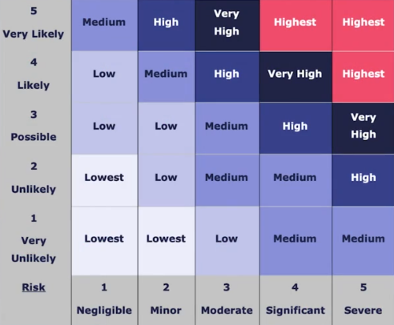

# Fundamental Cybersecurity Concepts

### Threat
Something or someone that possesses the potential to cause harm or damage to a system or data.

### Risk
**Risk** is the **likelihood-severity contrast** of a **threat**:

### Attack Vector
A **path or means** by which someone can gain **unauthorised access** to a computer system or network in order to deliver a malicious payload or exploit a vulnerability.

### Vulnerability 
A weakness that creates a **potential attack vector** in the system

### Authentication, Authorisation, and Accounting (AAA)

**Authentication** identifies the user and allows (or denies) access based on available and necessary credentials.

**Authorisation** provides things like length of time allowed on the network, controls who has access to certain folders, files, or storage locations, and to what extent do their permissions allow them to make change.

**Accounting** tracks the start and stop time of each session - can be used for billing or general tracking.

**AAAA - Authorisation, Authentication, Accounting, Auditing**

Sometimes **auditing** is also included into the framework to make it AAAA. **Auditing** is the process of reviewing and monitoring user activities and system events to ensure compliance with security policies and detect any unauthorised or suspicious actions.

##### Identification vs Authentication vs Authorisation vs Auditing

**Identification is who you are.** This can be labelled via username, securityID, smart card. **Authentication is proving who you are**, this can be done via username-password combo, OTP, or biometric data like fingerprint or retina scan. **Authorisation is what permissions you have**, it's what you're allowed to access and do once you've been authenticated. **Auditing** is the process of reviewing and monitoring user activities and system events to ensure compliance with security policies and detect any unauthorised or suspicious actions.

#### Authentication Factors

- Something you know
	- Password or "secret"
- Something you are
	- Fingerprint, retina scan, etc.
- Something you have
	- Smart card, token, two-factor code, etc.
- Somewhere you are
	- Location based
- Something you do
	- Signature, patterns of behaviour or language, etc.
- Someone you know
	- Social proof, having a friend or colleague "vouch" for you

#### Authenticating Systems
##### Multifactor Authentication
- Two or more pieces of information used to authenticate
	- Pin
	- Password
	- Fingerprint
- Must be from different categories
	- **Password and PIN would only be 1-factor because they both fall under "something you know"**

### CIA Triad (Confidentiality, Integrity, and Availability)
Three elements that help ensure that data is kept secure, accurate, and accessible to authorised users.
#### Confidentiality 
- Privacy
- Encryption or 2FA
- Airgaps
#### Integrity
- Consistency and accuracy
- File permissions/access control
- Version control
#### Availability
- Consistent Availability
- Patches, updates
- Backups, DR/HA

### Mitigation 
**Mitigation** defines **reducing the risk** (**impact** or **likelihood**) of a **threat** occurring.

### Counter-Measures
**Counter-Measures** are **specific actions or tools** aimed at **defending against** known **threats or attack** 

### Non-repudiation
The assurance that someone cannot deny the validity of something.
A service that is maintained so that a sender and recipient cannot deny having participated in the communication.

**PKI (public key infrastructure)** can provide non-repudiation through the use of public/private keys. Assuming that a user keeps his private key secure, data encrypted via that private key could only originate from that user.

### Hardening
System hardening is essentially patch management, it is doing what you can to stop vulnerabilities in your system.

### Network Hardening 
A secure network is only as strong as its weakest link. 
it is important to secure the end devices that reside on the network but also to secure the network connectivity and infrastructure itself.
some of these methods involve securing administrative access, maintaining passwords, and implementing secure communications.
A common practise for network hardening is to close unsecure and unnecessary ports on a firewall.

### GRC
**GRC** is a structured approach to aligning IT with business objectives while managing risk and ensuring compliance with laws and regulations. Each component plays a distinct but interconnected role in maintaining the security and integrity of systems and data.

#### Governance
Governance refers to the frameworks, policies, roles, and responsibilities that guide and oversee how an organization manages its IT systems and security posture. This includes:

- Defining security roles and responsibilities
- Establishing security policies and acceptable use policies (AUPs)
- Ensuring strategic alignment between IT security and business goals

#### Risk Management
Risk Management is the process of identifying, assessing, and mitigating risks to an organization’s assets. This involves:

- **Risk identification:** Cataloguing potential threats and vulnerabilities
- **Risk assessment:** Determining the likelihood and impact of risks
- **Risk treatment:** Deciding whether to mitigate, transfer, accept, or avoid the risk
- **Continuous monitoring:** Reassessing risk as systems and environments evolve

Risk management should be documented in a risk register and aligned with business continuity planning and incident response strategies.

#### Compliance
Compliance ensures that the organization adheres to relevant laws, regulations, standards, and internal policies. Non-compliance can result in legal penalties, reputational damage, or financial loss.

##### Key Legislation and Frameworks:

- **Data Protection Act:** Regulates the use of personal data and mandates secure processing.
- **Computer Misuse Act:** Criminalises unauthorised access and actions that compromise systems.
- **General Data Protection Regulation (GDPR):** A European Union regulation that governs the collection, processing, and storage of personal data.
- **NIST, ISO/IEC 27001 and 27002:** Widely recognised frameworks for referencing and implementing information security policies, controls, and overall governance.
	- **ISO/IEC 27001** is the **international standard** for establishing, implementing, maintaining, and continuously improving an **Information Security Management System (ISMS)**. It provides the **requirements**.
	- **ISO/IEC 27002** is a **code of practice** that provides **implementation guidance** for **ISO 27001**. It covers **security control objectives and best practices** including areas like access control, cryptography, physical security, and operational procedures.

Compliance also involves maintaining audit trails, documentation, user consent logs, access records, and ensuring that policies are enforced and understood by staff.

#### Authentication Factors

- Something you know
	- Password or "secret"
- Something you are
	- Fingerprint, retina scan, etc.
- Something you have
	- Smart card, token, two-factor code, etc.
- Somewhere you are
	- Location based
- Something you do
	- Signature, patterns of behaviour or language, etc.
- Someone you know
	- Social proof, having a friend or colleague "vouch" for you

#### Authenticating Systems
##### Multifactor Authentication
- Two or more pieces of information used to authenticate
	- Pin
	- Password
	- Fingerprint
- Must be from different categories
	- **Password and PIN would only be 1-factor because they both fall under "something you know"**

### Gap Analysis
Process of identifying and evaluating the discrepancies or "gaps" between an organisation's current security measures and its desired or required security posture.

### Zero Trust
Zero trust is an evolution from the traditional **perimeter-based security**.
Fundamentally, the principle is never automatically trust anything. No user, no device, no network component, regardless of any circumstance.

### Least Privilege Access
Least Privilege Access is a security principle where users and systems are granted only the minimum levels of access or permissions needed to perform their tasks. This limits potential damage if an account is compromised. For example, a user who only needs to read files shouldn't have write or execute permissions. Implementing least privilege reduces the attack surface and supports compliance with security policies.

### Micro-Segmentation
Micro-segmentation involves dividing a network into smaller, isolated segments to control traffic more precisely. Each segment can enforce specific security rules, limiting how threats spread within the environment. For instance, a compromised user workstation can be prevented from accessing sensitive databases by design. This approach enhances visibility and containment, especially in virtualised and cloud-based environments.

### Continuous Monitoring
Continuous Monitoring is the ongoing collection, analysis, and response to security data across systems and networks. It allows organisations to detect anomalies, vulnerabilities, or unauthorised changes in real time. Tools like SIEMs (Security Information and Event Management systems) are often used to automate this process. It supports a proactive security posture rather than reactive incident response.

### Multi-Factor Authentication (MFA)
Multi-Factor Authentication (MFA) strengthens user authentication by requiring two or more verification factors from different categories: something you know (password), something you have (security token or smartphone), and something you are (biometric). Even if one factor is compromised, unauthorised access is still unlikely. MFA is a key defence against credential-based attacks like phishing or brute force.

### Identity, Access, and Trust Management

#### Device and User Identity Verification
Identity verification ensures that only authenticated, authorised individuals and devices can access resources. This is foundational for Zero Trust Architecture.

- **Device Identity Verification**
    - Uses unique identifiers (e.g. MAC address, TPM chip, certificates) to verify device legitimacy.
    - Managed via Mobile Device Management (MDM) or Endpoint Detection and Response (EDR) systems.
    - May include posture assessment (OS version, patch status) before granting access.
- **User Identity Verification**
    - Involves strong authentication (MFA, biometrics) and federated identity systems (e.g. SAML, OIDC).
    - Enhanced with contextual data: location, time of day, behavioural patterns.
    - Can integrate with Identity Providers (IdPs) like Azure AD, Okta, etc.        

### Encryption
Encryption transforms data into unreadable formats unless decrypted with a valid key. It supports confidentiality, integrity, and non-repudiation.

- **At Rest**
    - Disk or file-level encryption using AES-256 or similar standards.
    - Common tools: BitLocker, LUKS, EFS.
- **In Transit**
    - TLS/SSL protects data moving across networks.
    - VPNs and IPsec provide secure tunneling and authentication.
- **End-to-End**
    - Only sender and receiver can decrypt (e.g. Signal, ProtonMail).
- **Key Management**
    - Secure storage and rotation of cryptographic keys via HSM or KMS (AWS KMS, Azure Key Vault).

### Access Control
Access control ensures users and systems can only perform authorised actions.

- **Role-Based Access Control (RBAC)**
    - Permissions based on roles (e.g. HR, IT).
- **Attribute-Based Access Control (ABAC)**
    - Decisions based on user attributes, environment, and resource properties.
- **Mandatory Access Control (MAC)**
    - Central authority assigns access (common in government/military).
- **Discretionary Access Control (DAC)**
    - Resource owners set access permissions.
- **Policy Enforcement**
    - Access rules enforced at login and during session (e.g. through NAC, firewalls, or PEPs).

### Zero Trust Security Architecture

#### Assume Breach
Assume that perimeter defences will fail and internal threats exist. Systems should operate as if compromise is imminent or already occurred.

- Requires:
    - Continuous monitoring
    - Network segmentation
    - Strong identity verification
    - Least privilege enforcement
### Control Plane

#### Policy Engine

- The brain of access decisions.
- Evaluates policies based on identity, device health, resource sensitivity, time, and location.
- Determines whether access should be granted, denied, or challenged.

#### Policy Administrator

- Translates policy engine decisions into actionable controls.
- Coordinates with identity providers, PEPs, and logging systems.

##### Adaptive Identity

- Dynamically adjusts access based on user behaviour, device changes, or threat intelligence.
- Uses AI/ML to establish baselines and flag anomalies.

##### Threat Scope Reduction

- Minimises potential attack surface by enforcing granular access controls.
- Integrates with threat intelligence to dynamically adjust policies.

##### Policy-Driven Access Control

- Automates access decisions based on pre-defined logic.
- Reduces human error and improves auditability.

### Data Plane

#### Implicit Trust Zones

- Deprecated concept in Zero Trust.
- Traditional networks assumed internal traffic was "safe."
- Modern approach removes this assumption—internal and external are treated with equal scrutiny.

#### Subject/System

- Subjects: users, services, or applications requesting access.
- Systems: assets or data being accessed.

#### Policy Enforcement Point (PEP)

- The gatekeeper.
- Enforces decisions made by the Policy Engine.
- Can be network-based (firewalls, proxies) or host-based (agents, middleware).

### Physical Security

#### Bollards

- Prevent vehicular access to sensitive areas.
- Can be fixed or retractable.

#### Access Control Vestibule (Mantrap)

- Double-door system restricting passage to one person at a time.
- Used in high-security buildings like data centres or military facilities.

#### Fencing

- Physical boundary layer to deter or delay unauthorised access.
- Often enhanced with sensors or cameras.

#### Video Surveillance

- CCTV and IP cameras provide real-time monitoring and recording.
- Integrated with motion detection and video analytics.

#### Security Guard

- Human element of physical security.
- Can provide deterrence, verification, and incident response.

#### Access Badge

- ID cards with RFID, NFC, or magnetic stripes.
- Can enforce time-restricted, role-based access to areas.

#### Lighting

- Well-lit perimeters discourage intruders.
- Supports surveillance and enhances safety.

#### Sensors

##### Infrared Pressure

- Detects changes in infrared signature or pressure—used in perimeter alarms.

##### Microwave

- Sends signals between transmitters and receivers—detects motion.

##### Ultrasonic

- Emits high-frequency sound waves—detects presence or movement via Doppler shift.

### Deception and Disruption Technology

#### Honeypot

- Decoy system emulating a real service to attract attackers.
- Used to study behaviour or delay progression into the network.

#### Honeynet

- Network of honeypots.
- Simulates an entire infrastructure to gather in-depth threat intelligence.

#### Honeylife (Deceptive Files)

- Live systems seeded with fake documents, credentials, or services.
- Designed to trigger alerts upon interaction.

#### Honeytoken

- Fake credentials or records embedded in real systems.
- Use cases include detecting unauthorised access, insider threats, or lateral movement.

