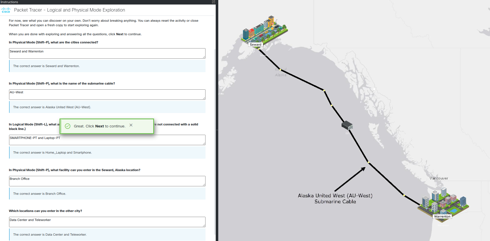

# 1.1.6 Packet Tracer Tutored Activity - Logical and Physical Mode Exploration 

This Packet Tracer Tutored Activity is an overview of the logical and physical views in Cisco Packet Tracer.

## Intro

The first section of the activity helps to get an idea of how the user interface works, and asks simple questions that can be answered by clicking around the GUI:

