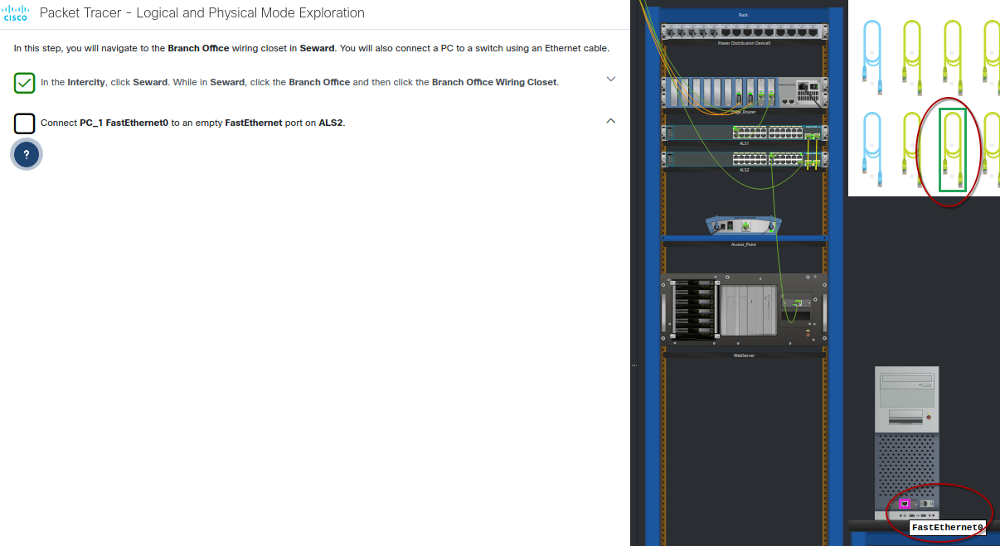
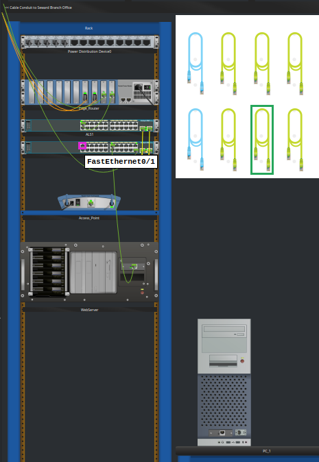
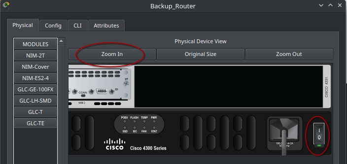

# 1.1.6 Packet Tracer Tutored Activity - Logical and Physical Mode Exploration 

This Packet Tracer Tutored Activity is an overview of the logical and physical views in Cisco Packet Tracer.

## Intro

The first section of the activity helps to get an idea of how the user interface works, and asks simple questions that can be answered by clicking around the GUI:

After the first set of questions, it asks to zoom into the **wiring closet** in the **Branch Office** **in **Seward**. After this You need to connect the PC to the ALS2 device using their respective **Ethernet ports**:

In order to connect the laptop to the backup router, I had to right click on the router in order to view the rear side where the USB port is. It is not immediately obvious where the USB port is on the router and how to connect a cable to it.