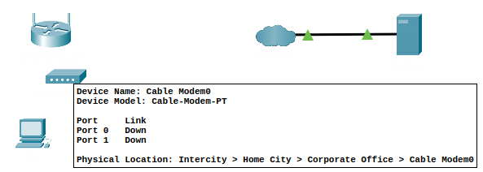

# Packet Tracer Activity: Simple Network Build and Configuration

## Objective
Document progress in building a simple network and verifying end device connectivity using Packet Tracer.

## Part 1: Build a Simple Network

### Step 1: Devices Added
- PC added to workspace (Path: `End Devices > PC`)

- Laptop added to workspace (Path: `End Devices > Laptop`)

- Cable Modem added to workspace (Path: `Network Devices > WAN Emulation > Cable Modem`)

### Step 2: Device Names Renamed
| Device      | New Display Name |
| ----------- | ---------------- |
| PC          | MaiksPC          |
| Laptop      | MaiksLaptop      |
| Cable Modem | LocalModem       |
- Select device -> Config -> Rename

### Step 3: Physical Cabling
- PC connected to Wireless Router  
  - Cable Type: Copper Straight-Through  
  - PC Port: `FastEthernet0`  
  - Router Port: `Ethernet 1`

- Wireless Router connected to Cable Modem  
  - Cable Type: Copper Straight-Through  
  - Router Port: `Internet`  
  - Modem Port: `Port 1`

- Cable Modem connected to Internet Cloud  
  - Cable Type: Coaxial  
  - Modem Port: `Port 0`  
  - Cloud Port: `Coaxial 7`

## Part 2: Configure End Devices and Verify Connectivity

### Step 1: PC Configuration
- DHCP enabled

	 - Used PC desktop and Command Prompt to verify IP address received via `ipconfig -all`
	 
	 
- Pinged `cisco.srv`
	- Used command `ping cisco.srv`
		

---

### Step 2: Laptop Configuration

#### Hardware Setup
- Powered off Laptop
- 
- Removed Ethernet Module
	
- Installed Wireless WPC300N Module
	
- Powered on Laptop
	 

#### Wireless Setup
-  Connected to `HomeNetwork` via PC Wireless
	
	
-  DHCP enabled and IP Address received
	
	
- Verified connectivity using web browser (`cisco.srv`)
	

---

## Reflection and Notes
- What worked well?
	- Swapping out laptop components and using the wireless card worked flawlessly.
	- I did get a better understanding of how home networks are connected to ISP networks. I'm now able to add an explanation of modems into my network architecture folder.
- What issues did you encounter?
	- I was confused by the UI at first and used the incorrect cable types. This caused ping to fail and I had to come back another day to understand what happened.
- What would you do differently next time?
	- Take more care when reading the activity overview.

## IP Addressing Table

| Device | IPv4 Address | Subnet Mask   | Default Gateway |
| ------ | ------------ | ------------- | --------------- |
| PC     | 192.168.0.2  | 255.255.255.0 | 192.168.0.1     |
| Laptop | 192.168.0.3  | 255.255.255.0 | 192.168.0.1     |
