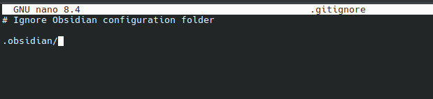
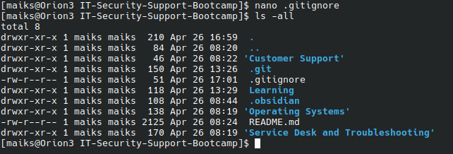

# Issue Report: Lack of Knowledge About `.gitignore` Leading to Unwanted Files in Git

---

## 1. Identify the Problem

An unwanted folder was accidentally pushed to a Git repository.  
Initially, the symptom appeared to be an isolated mistake, but deeper review revealed the underlying issue was a lack of understanding of `.gitignore` files and their correct use.

---

## 2. Establish a Theory of the Cause

The problem likely occurred because:

- I had no `.gitignore` file set up before the initial commit.
- If i create a `.gitignore` with correct syntax, the problem will be solved.

---

## 3. Test the Theory

To confirm the theory, basic research on `.gitignore` syntax was conducted:

**Basic Syntax**:
- `foldername/` → Ignores a whole folder.
- `filename.ext` → Ignores a specific file.
- `*.ext` → Ignores **all files** with a specific extension (example: `*.log` ignores all `.log` files).
- `/foldername/` → Ignores folder from the **root only** (not nested matches).
- `!important.txt` → The `!` symbol means **do NOT ignore** this file, even if its folder is ignored.

This confirmed there was an issue with insufficient knowledge about `.gitignore` behaviour.

I created a `.gitignore` file using the terminal:

I confirmed the file was created using `ls -all`

Used `git add .` and `git commit -m "gitignore" ` to commit the changes to the repository

---

## 4. Evaluate Results: Is it working?

After testing and confirming how `.gitignore` works:

- It was clear that the unwanted folder could have been avoided if `.gitignore` was properly understood and applied before pushing.

---

## 5. Establish a Plan of Action

Plan:

- Create a proper `.gitignore` file for the project.
    
- Remove the unwanted folder from Git tracking manually.
    
- Commit and push the changes to update the repository.
    
- Create internal documentation (this document) explaining `.gitignore` syntax and behavior, to prevent the same issue in future projects.
    

---

## 6. Implement the Plan

### Actions Taken:

1. Created a `.gitignore` file in the project root with correct syntax.
    
2. Added the unwanted folder to `.gitignore`.
    
3. Ran the following commands to remove the folder from tracking:
    
    bash
    
    CopyEdit
    
    `git rm --cached -r unwanted-folder-name/ git add .gitignore git commit -m "Remove unwanted folder and add proper .gitignore" git push`
    
4. Wrote this documentation explaining the `.gitignore` syntax and typical use cases.
    

---

## 7. Verify Full System Functionality

Confirmed:

- The unwanted folder was no longer pushed to the Git repository.
    
- Future commits ignored the folder properly.
    
- `.gitignore` rules were functioning as intended.
    
- A documented reference now exists to prevent future misunderstanding.
    

---

## 8. Document Findings

### What Went Wrong:

- Lack of prior knowledge of `.gitignore` behavior and syntax caused improper project setup.
    
- As a result, unnecessary files and folders were tracked and pushed to Git.
    

### How `.gitignore` Works (Summary):

- `.gitignore` lists patterns of files/folders Git should ignore when adding files to the repository.
    
- Key syntax rules:
    
    - `foldername/` → Ignore a directory and everything inside it.
        
    - `*.ext` → Ignore all files with a specific extension (e.g., all `.log` files).
        
    - `filename.ext` → Ignore a single file.
        
    - `!filename.ext` → Force Git to track a file even if its folder or pattern is otherwise ignored.
        
    - `/foldername/` → Ignore a folder only at the root level, not nested elsewhere.
        

**Important**: `.gitignore` only prevents **new files** from being tracked.  
Already tracked files must be manually removed with:

bash

CopyEdit

`git rm --cached filename`

### Preventative Measures:

- Always create and review a `.gitignore` file before starting Git tracking or making the first commit.
    
- Maintain a personal reference guide (such as this document) for `.gitignore` usage and examples.
    
- Regularly verify what is being staged for commits using `git status` before pushing.