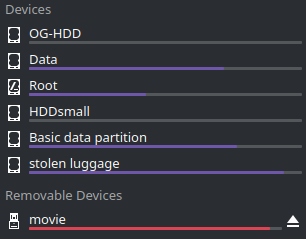

# Issue Report: Non-root Drives Not Automatically Mounting on Linux Boot


## 1. Identify the Problem

When booting into my Linux system, only the root drive is automatically mounted.  
I want **all drives** mounted automatically at startup to avoid repeating the manual process of mounting through CLI after every reboot.


## 2. Establish a Theory of the Cause

Initial theory:

- Drives aren't listed in `/etc/fstab`, which is responsible for controlling filesystem mounts at boot.
- System relies on manual CLI mounting or mounting via desktop environment tools for removable media.


## 3. Test the Theory

**Check Current Mount Points**

Ran the following:

`lsblk -f`


This displayed the UUIDs, filesystem types, and mountpoints.


**Check `/etc/fstab`**

`cat /etc/fstab`


Only root and a few system partitions (like `/home`, `/var`, `/boot/efi`) were listed.


## 4. Evaluate Results: Theory Confirmed?

Confirmed: **None of the other data drives were present** in `/etc/fstab`.

Therefore, the system doesn’t know to mount them on boot.


## 5. Establish a Plan of Action

Plan:

- Use `lsblk -f` to gather UUIDs and filesystem types for all non-mounted drives.
- Create custom mount points under `/mnt/` or `/media/`.
- Add entries for each drive in `/etc/fstab` using UUIDs for stability.
	- Ensure stability when removable drives are missing.
	- Create a **backup** of the original `/etc/fstab` in case of misconfiguration.
- Test mounts manually first to validate syntax.
- Reboot and test.

## 6. Implement the Plan

### Step 1: Identify Drive Info

Ran:
`lsblk -f`


>/dev/sdc3 is only mounted on /mnt/windows because I've been manually mounting it when I need access to documents in my old documents folder

Collected UUIDs for the following partitions:

- `/dev/sda1`, `/dev/sdb1`, `/dev/sdd1`, `/dev/sde2`, `/dev/sdf1`, `/dev/sdc3`

One of the drives listed (`/dev/sdf1`) is a **removable drive** that might not be present when booting, which might cause errors or delays when the system tries to mount it. To prevent this, the commands **`nofail`** and **`x-systemd.device-timeout=1s`** are used in the `/etc/fstab` entry:
`UUID=BC40B6C340B68424 /run/media/maiks/movie auto defaults,nofail,x-systemd.device-timeout=0s 0 0`

| Option                        | Purpose                                 |
| ----------------------------- | --------------------------------------- |
| `0 0` (last two columns)      | Skip dump and fsck                      |
| `nofail`                      | Avoid boot failure if device is missing |
| `x-systemd.device-timeout=0s` | Reduce boot delay if device is missing  |
### Step 2: Create Mount Points

Used the command:

`sudo mkdir -p /mnt/sda1 /mnt/sdb1 /mnt/sdd1 /mnt/sde2`

### Step 3: Backup fstab

Used the command:

`sudo cp /etc/fstab /etc/fstab.bak`


### Step 4: Edit `/etc/fstab`

Opened with:

`sudo nano /etc/fstab`


Added entries:

```
UUID=C0404E01404DFEA2  /mnt/sda1  ntfs    defaults,nofail  0  2
UUID=4AB6AB3BB6AB2683  /mnt/sdb1  ntfs    defaults,nofail  0  2
UUID=B0BEA362BEA31FB8  /mnt/sdd1  ntfs    defaults,nofail  0  2
UUID=4E1052E61052D515  /mnt/sde2  ntfs    defaults,nofail  0  2
UUID=BC40B6C340B68424  /run/media/maiks/movie ntfs    defaults,nofail,x-systemd.device-timeout=0s 0 0 
```

Used `cat` to confirm:


### Step 5: Test the Mounts Manually

`sudo mount -a`





No errors were returned - confirmed mounts succeeded.

## 7. Verify Full System Functionality

- Rebooted the machine.
- All drives mounted correctly excluding /dev/sdc3
- New ticket needed for /dev/sdc3 issue

## 8. Document Findings

### What Went Wrong:

- Drives were not mounting because they weren’t specified in `/etc/fstab`.
- This led to repetitive manual mounting after every reboot.
- /dev/sdc3 appears to have permission issues beyond not being included in /etc/fstab.

### How to Mount Drives Automatically (Summary):

- Use `lsblk -f` to get UUIDs and filesystem types.
- Create persistent mount points in `/mnt/`.
- Add entries to `/etc/fstab` using UUIDs, e.g.:
    ini
    Copy code
    `UUID=xxxx-xxxx /mnt/sdX1 auto defaults,nofail 0 2`
- Test mounts with `sudo mount -a` before reboot.
- Back up original `/etc/fstab` before editing.
- Use `x-systemd.device-timeout=1s` to prevent long delays when booting without listed removable drives.

### Preventative Measures:

- For every fresh Linux install, configure `/etc/fstab` early for all persistent storage.    
- Always use UUIDs to avoid device name changes (e.g., `/dev/sda` becoming `/dev/sdb` after a reboot).
