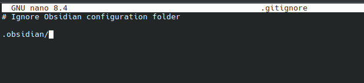
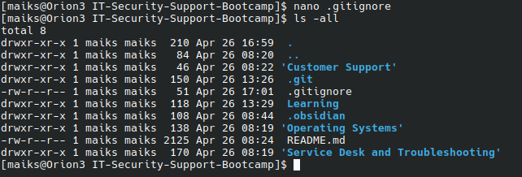
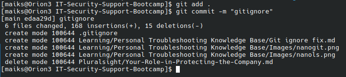
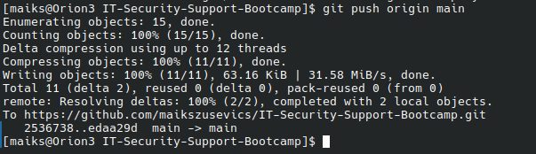
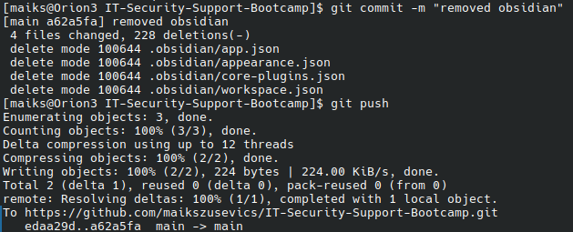
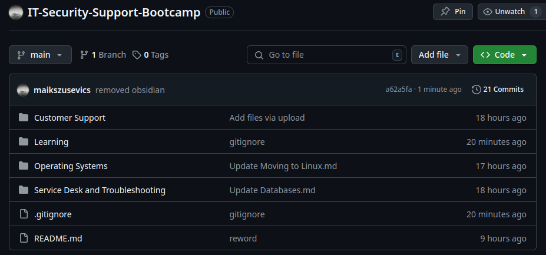

# Issue Report: Lack of Knowledge About `.gitignore` Leading to Unwanted Files in Git

## 1. Identify the Problem

An unwanted folder was accidentally pushed to a Git repository.  
Initially, the symptom appeared to be an isolated mistake, but deeper review revealed the underlying issue was a lack of understanding of `.gitignore` files and their correct use.

## 2. Establish a Theory of the Cause

The problem likely occurred because:

- I had no `.gitignore` file set up before the initial commit.
- If i create a `.gitignore` with correct syntax, the problem will be solved.

## 3. Test the Theory

To confirm the theory, basic research on `.gitignore` syntax was conducted:

**Basic Syntax**:
- `foldername/` → Ignores a whole folder.
- `filename.ext` → Ignores a specific file.
- `*.ext` → Ignores **all files** with a specific extension (example: `*.log` ignores all `.log` files).
- `/foldername/` → Ignores folder from the **root only** (not nested matches).
- `!important.txt` → The `!` symbol means **do NOT ignore** this file, even if its folder is ignored.

This confirmed there was an issue with insufficient knowledge about `.gitignore` behaviour.

I created a `.gitignore` file using the terminal:

I confirmed the file was created using `ls -all`

Used `git add .` and `git commit -m "gitignore" ` to commit the changes to the repository

Used `git push origin main` to push the changes to the online repository

## 4. Evaluate Results: Is it working?

After pushing to git, I checked the website to see that the gitignore file had been uploaded, but the unwanted folder was still there.

Result?

Not fixed, back to hypothesis.

---
## 2. Establish a Theory of the Cause (Second Iteration)

Second hypothesis:
- A `.gitignore` file will not remove folders that are already tracked, and there is a separate git command for that.

## 3. Test the Theory (Second Iteration)

To confirm the theory, a simple google search was conducted to find the command for removing a folder from a git repository is `git rm --cached -r unwanted-folder-name/`

So in a bash terminal, I run the command `git rm --cached -r .obsidian/`
Followed by `git commit -m` and `git push`

## 4. Evaluate Results: Is it working? (Second Iteration)

After pushing to git, I checked the website to see that the .obsidian folder was gone and the repository looked like it was supposed to:

## 5. Establish a Plan of Action

Plan:
- Commit and push the changes to update the repository.
- Create personal documentation (this document) explaining `.gitignore` syntax and behaviour, to prevent the same issue in future projects.

## 6. Implement the Plan

### Actions Taken:

1. Created a `.gitignore` file in the project root with correct syntax.
2. Added the unwanted folder to `.gitignore`.
3. Ran the following commands to remove the folder from tracking:

    `git add .`
    `git rm --cached -r unwanted-folder-name/ 
    `git commit -m "Remove unwanted folder, add gitingore" 
    `git push`
    
4. Wrote this documentation explaining the `.gitignore` syntax and typical use cases.

## 7. Verify Full System Functionality

Confirmed:

- The unwanted folder was no longer pushed to the Git repository.
- Future commits ignored the folder properly.
- `.gitignore` rules were functioning as intended.
- A documented reference now exists to prevent future misunderstanding.

## 8. Document Findings

### What Went Wrong:

- Lack of prior knowledge of `.gitignore` behaviour and syntax caused improper project setup.
- As a result, unnecessary files and folders were tracked and pushed to Git.

### How `.gitignore` Works (Summary):

- `.gitignore` lists patterns of files/folders Git should ignore when adding files to the repository.
- Key syntax rules:
    - `foldername/` → Ignore a directory and everything inside it.
    - `*.ext` → Ignore all files with a specific extension (e.g., all `.log` files).
    - `filename.ext` → Ignore a single file.
    - `!filename.ext` → Force Git to track a file even if its folder or pattern is otherwise ignored.
    - `/foldername/` → Ignore a folder only at the root level, not nested elsewhere.

**Important**: `.gitignore` only prevents **new files** from being tracked.  
Already tracked files must be manually removed with:

`git rm --cached -r unwanted-folder-name/` 

### Preventative Measures:

- Always create and review a `.gitignore` file before starting Git tracking or making the first commit.
- Maintain a personal reference guide (such as this document) for `.gitignore` usage and examples.
- Regularly check what is being staged for commits using `git status` before pushing.
#### Common Git Commands

- `git init` - Initialises a new Git repository in the current directory
- `git clone [url]` - Creates a copy of a remote repository on your local machine
- `git add [file]` - Stages changes for commit (use `git add .` for all changes)
- `git commit -m "[message]"` - Records staged changes with a descriptive message
- `git status` - Shows the status of modified files in your working directory
- `git branch` - Lists all local branches
- `git branch [name]` - Creates a new branch
- `git checkout [branch]` - Switches to the specified branch
- `git checkout -b [branch]` - Creates and switches to a new branch in one command
- `git merge [branch]` - Merges the specified branch into the current branch
- `git remote add [name] [url]` - Adds a remote repository
- `git push [remote] [branch]` - Sends local commits to the remote repository
- `git pull [remote] [branch]` - Fetches changes from remote and merges them
- `git fetch` - Downloads content from remote without merging
- `git log` - Shows commit history
- `git diff` - Shows changes between working directory and last commit
- `git reset [file]` - Unstages a file while preserving changes
- `git reset --hard [commit]` - Discards all changes and reverts to specified commit
- `git show [commit]` - Shows details of a specific commit
- `git revert [commit]` - Creates a new commit that undoes changes from a specified commit
- `git clean -f` - Removes untracked files from the working directory
- `git clean -fd` - Removes untracked files and directories
- `git clean -n` - Shows what would be removed without actually removing anything
- `git rm [file]` - Removes a file from both the working directory and staging area
- `git rm --cached [file]` - Removes a file from version control but keeps it locally
- `git mv [old-path] [new-path]` - Moves or renames a file and stages the change
