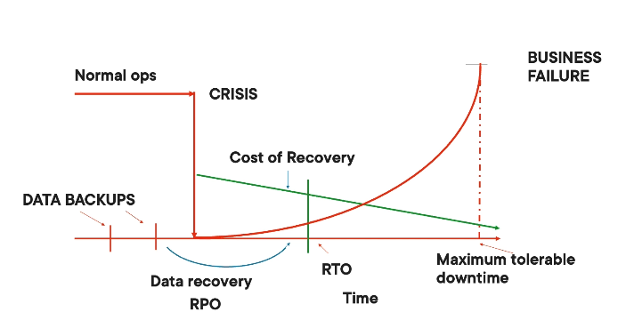
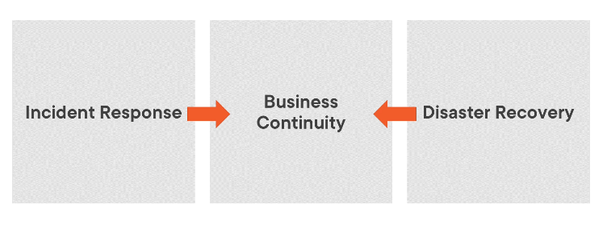
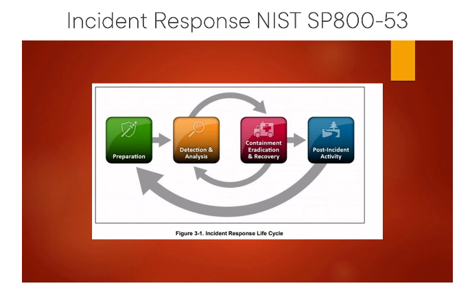

# business continuity, disaster recovery, and incident response
> https://app.pluralsight.com/library/courses/business-continuity-disaster-recovery-incident-response-cc-cert/table-of-contents

## Outcomes of the Elements of a BCMS

Outcomes of a Business Continuity Management System:
Incident response planning 
	Life Safety 
	Containment
	Documentation 
	Return to normal 
Business continuity Planning 
	**Business Impact Analysis (BIA)**
	**Critical Business Functions (CBFs)**
	**Recovery Time objective (RTO)**
	**Data recovery Point objective (RPO)**
	Requirements to enable recovery of systems 
Disaster Recovery Planning
	Relocation of IT and other services to another location 

## Incident Response Planning

Event - any measurable occurrence 
incident - a type of event with the potential to affect business mission 

Business Resilience:
the ability to continue operations even during adverse circumstances 

Response Planning 
	 Historical events 
	 Current threats 
	 Areas of change 

Incident management is a structured process 
	 preparation 
	 prevention 
	 detection 
	 containment
	 restoration 
	 lessons learned 

Preparation 
	 Policy 
	 Authority 
	 Team members 
	 Procedures 
	 Documentation 
	 Reporting

Prevention 
	Offense drives defence 
	monitor systems, networks, applications, and users
	Test controls 
	awareness

MANAGE THE INCIDENT DONT LET THE INCIDENT MANAGE YOU 
PREVENTION OVER RECOVERY - LEARN FROM INCIDENTS HOW TO BE BETTER PREPARED 

Detection 
	 Tools and technology 
		 Behaviour analysis
		 Signatures
		 Heuristics (Type of AI that tries to learn when something is undesirable)
	Alarms
	Audits

Incident Detection 
	Helpdesk first line 
			Trouble tickets 
				Look for patterns 
	Alerts from monitoring systems 

First priority when something goes wrong is life safety

Classification 
	Is it a real incident or just noise/false positive 
	True positive/Real incident 
		Minor
		Serious 
		Catastrophic 
	Internal or external
	Intentional or accidental 
	activation of response teams 

Containment
	Isolation 
		Fire doors 
		network connection 
		quarantine 
			sandbox
				Put malware or infected machine into a secure environment where its behaviour can be observed so that it is understood
	Power Down 
	Monitoring (for just minor incidents)

Containment considerations 
	Response depends on :
		Criticality 
		Ability to spread 
		Gathering of evidence 

Eradication 
	Removal of damage 
	rebuild
		Backups 
		patches 
	Replacement of hardware

Restoration 
	Return to normal 
	Timelines 
		Prioritisation of recovery 
	Prevent re-infection

Documentation
	Steps and procedures used in recovery
	Retain to assist in future incidents 

Reporting 
	Reporting conclusion of the incident 
		What caused the incident 
			Multiple factors / just one factor
		What was done to address and mitigate 
		Commendations for staff
		Lessons Learned 

## Business Continuity Planning
### BCMS Program Management 

- Project Initiation 
- Business impact analysis
- Write the plan(s)
- Implement and test the plans 
- Maintain the plans 

### BIA - Business Impact Analysis 
arguably the most important step 
Analysis of the impact on the business 
Determines:
	- Critical business functions (some departments are more important than others)
	- Critical Supporting processes (dependencies of the critical departments)
	- Resources requirements
	- Priorities for recovery 
BIA is about impact over time - unlike risk management which is impact and likelihood
Normal Ops -> crisis -> level of business drops (no longer meeting our mission) -> initially people understand that there might be an issue sometimes -> over time there is an exponential amount of impact (reputation/financial damage)
What we try to determine is at what level of impact can we no longer continue operating and have to shut down the business. It is the maximum tolerable downtime. 
Group business process with its supporting processes 
- Cannot recover essential services without also recovering their supporting services (dependencies)

Tolerable outages:
	Determine the **maximum tolerable downtime (MTD)** for the critical processes
	Determine the **recovery time objectives (RTO)**
	RTO must be significantly less than MTD
	Determine the **recovery point objectives (RPO)**
		Measures the amount of data can be lost in case of an outage
		How old would the data be when it is restored
Resources requirements 
	Determine the resource requirements to restore systems 
		Includes critical subprocesses/dependencies 
		Includes controls put in place to make sure this cannot easily happen again 

Cost of recovery is often the inverse of the duration of the outage 
	If there is a very minimal outage time the cost of recovery is very high 
	Want to find a balance point where the cost of recovery is in line with the impact 

Priorities
	Establish system recovery priority 
		Based on cost of recovery options and impact on the business 
		Option must be 
			Feasible
			Acceptance
			Suitable
		Often contentious 
		Must be approved by senior executes 

### Data Preservation and Recovery

RPO drives backup strategies 

- Cloud Storage 
- Internal hard drives 
- removable storage media 
- mirroring 
- vaulting 
- Remote Journaling 

System resilience 
	Fault tolerant 
		Clustering
	High availability 
		Failover
	Quality of service

## Disaster Recovery

RELOCATION OF IT AND OTHER SERVICES TO AN ALTERNATE LOCATION 

Recovery sites

Site selection 
	RTO drives site selection 
	Faster Recovery = higher costs
	systems recovery sequence based on criticality to the business 
	a manager may have employees and systems at different sites based on process criticality 

the selection of a contingency site:
	Cost
	Security
	Availability (meet RTO)
	Proximity
	Logistics for employees
	Support

Writing the Plans 
	written by the entire BCP team
	Action orientated
	plan written to address the most resource intensive situation (worst case scenario)
		All lesser situation are included

A crisis is a time of elevated risk for an organisation. many normal controls are missing 

Assign teams
	Roles and responsibilities
		Leaders and deputies
		Cross training 
	Reporting relationships
	Training and tools 

Communication and reporting 
	Stakeholders
		Management
		Regulatory agencies
		Customers
			Privacy breach
		Suppliers
		Shareholders

Reporting
	Regular reports on the status of the crisis to management 
		Emergency operations centre (EOC)
		Milestones and progress

Restoration
	Recovery of business functions 
		Prioritises the most critical business processes first
		Restoration to "normal" starts with the least critical business functions first

Testing the plan 
	find deficiencies 
	train staff
		Develop skills
	Thorough tests
		Realistic
	Start small - then increase
		Apply lessons learned

