# Host Enumeration Activity

“In this challenge a user must identify systems in a corporate network to support security audit and vulnerability management activities of unmanaged computer assets.

The commands in this challenge will mostly be common to base installations of Windows and Linux distributions. In a business environment you may not be able to install the software you want. Reliance on existing common commands in these situations is of great advantage.

The host enumeration challenges consist of two virtual machines, one Linux and one Windows, this challenge first looks at Linux.”

---

## Linux Host Enumeration

- In a Linux environment it is common practise to identify the host network details. You can view the host network details by using the command ```ip addr```.

  
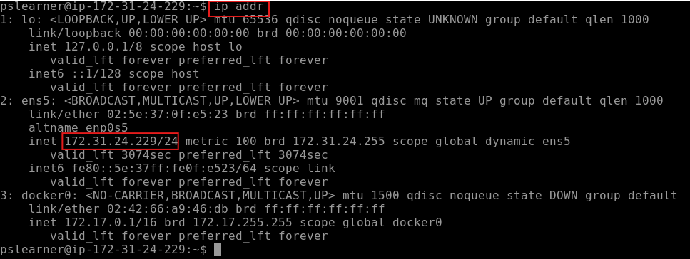


In the output of ip addr, the first network interface listed is the loopback interface - this is how a computer is able to communicate with itself. It is a virtual interface that exists entirely within the operating system’s networking stack.

The second interface, listed here as ens5 (en=ethernet, s5=slot 5), is the actual network device which allows the computer to connect to a network.
IP: 172.31.24.229


Adding  ```> ipaddrdetails.txt``` to the end of the command will save the output of the command to a text file named ipaddrdetails.txt.

```ls``` This command lists all items in the current directory.


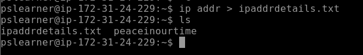


```cat``` This command displays the contents of a file


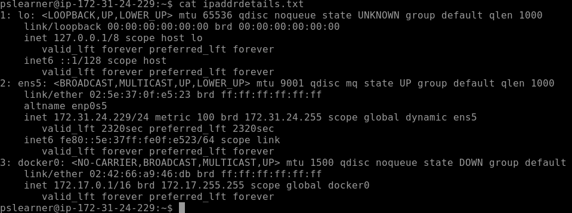


```ifconfig``` Command is similar to ```ipaddr``` but more detailed.

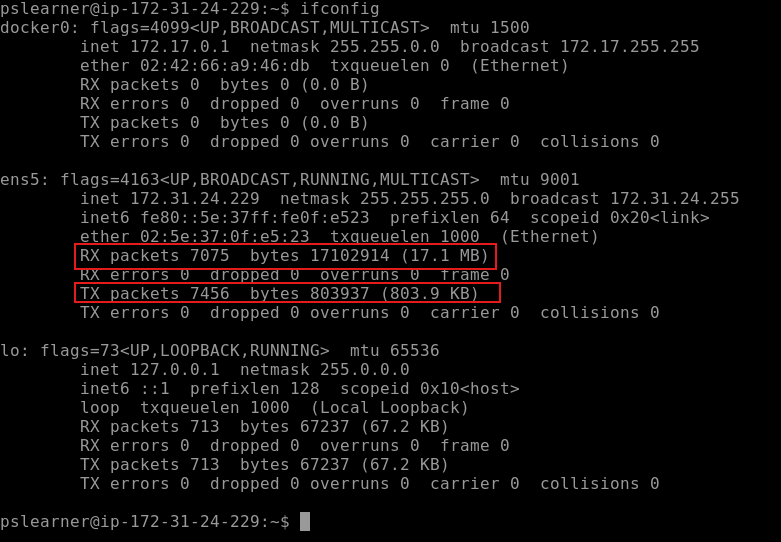


The output of  `ifconfig`  will look very similar to the previous `ip addr` command. It’s good to know both commands as some installations of Linux may only have one command available to use.
`ifconfig`  also includes statistics on received and transmitted packets so you can quickly see which network device is currently sending and receiving data. 

The `whoami` command displays who is currently logged in on the terminal.
The `w` command displays who is currently logged on and what they are doing.


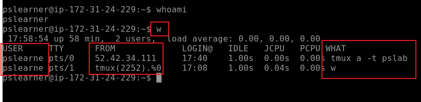


`sudo hping3 127.0.0.1 -c 5` Command will tell the machine to ping itself 5 times.


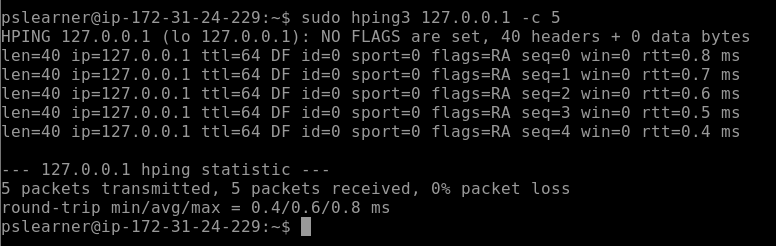


In the screenshot above, if there are any connection issues on the network, errors would be displayed. Ping is useful for identifying interconnected systems on the network. `hping` is a much more advanced tool with many features, such as advanced techniques for **testing firewalls**, **port scanning** and help **penetration test**ers look for weakness.

`traceroute` is a network diagnostic tool that shows the route packets take across an IP network from your computer to a destination server. The example below is how the output looks from a secure lab environment, and therefore doesn’t show all of the traffic “hops” in order to get from the source to the destination. In the later Windows section a full example of traceroute is shown through Powershell.


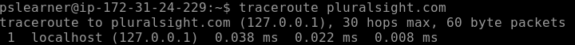


`hostname` command prints the name of the system in use.


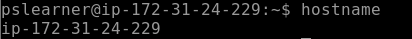

---

## Windows Host Enumeration

Next, the Windows environment:

`ipconfig` Windows command will list details about your network adaptors:


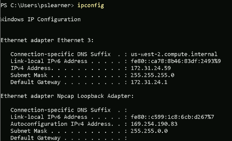


`ipconfig /all` is a more detailed version of the same command:


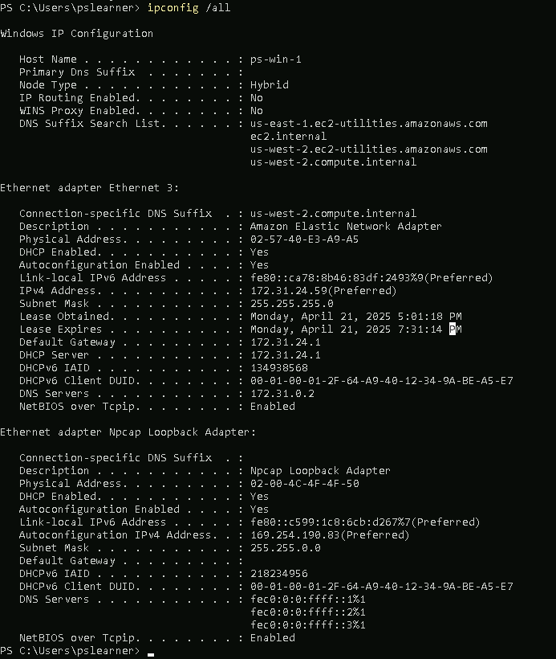


`ipconfig /all > network details.txt` saves the output to a text file, and
`ls` command is used to list folders/files in the current directory:


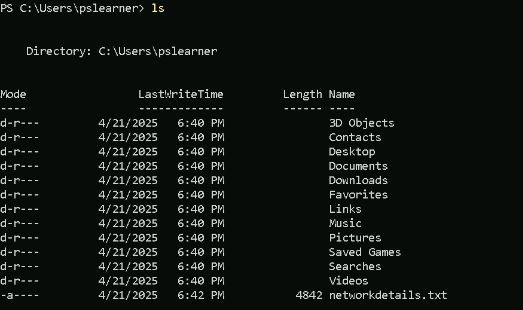


`ping` will give confirmation of connectivity to other systems routable on the network.


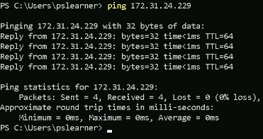


`pathping` is another command available on Windows, it provides more detail and statistics on connectivity and routing to other systems.


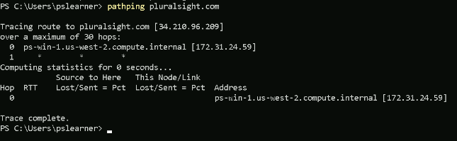


`whoami` Windows command prints the name of the user:


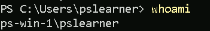


`whoami /?` shows all of the other options for the `whoami` command.

Traceroute on windows Powershell: `tracert`


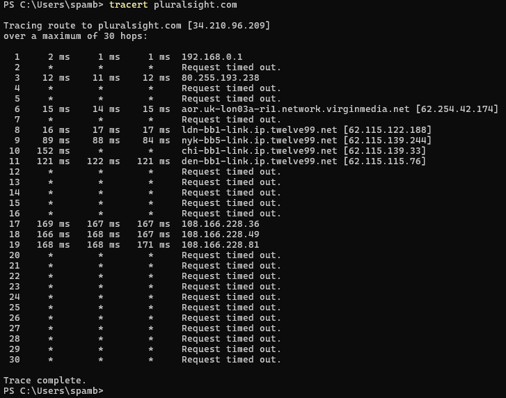


This traceroute result shows the different traffic “hops” in order to get from the source to the destination.

---


The next example will show how to generate a list of IP addresses and then use them as part of a semi-automated process in Powershell.

`$myipaddresses = 1..254 | ForEach-Object -Process{'172.31.24.' + $_}`

The above command will loop through from 1 to 254 and create a list of unique IP addresses starting from 172.31.24.1 all the way to 172.31.24.254. The resulting list is then stored in the computer memory as $myipaddresses.


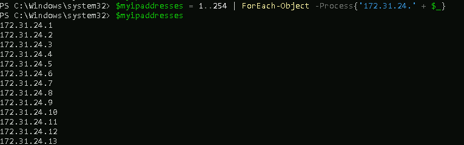


The generated list of IP addresses can be used with other commands. 

In the following example, the command will loop through the list of IP addresses generated and attempt to ping each IP address.

`foreach ($ip in $myipaddresses) { ping $ip }`


`Control + C` was used to terminate the running process early, otherwise it would take a long time to complete every ping attempt.

---

## The Last Challenge


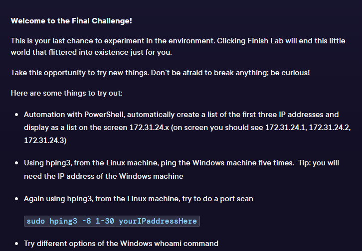


### Creating a list of 3 IP addresses and displaying them on the screen in PowerShell:
Using the same command as used earlier to generate 253 IP addresses, but changes 254 to be just 3.

`$myipaddresses = 1..3 | ForEach-Object -Process{'172.31.24.' + $_}`


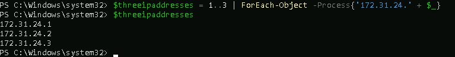


### Ping the Windows machine from the Linux machine 5 times using hping3:

- First I had to get the IP of the windows machine, which I did by running the ipconfig command on the windows machine.


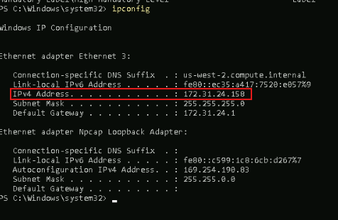


- I attempted to use `sudo hping3 -1 -5 172.31.24.158`, but it did not work as the result was 100% packet loss:


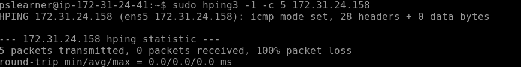


- Upon Googling the issue, I found the first step to be checking the firewall settings on the windows machine. I used the command `Get-NetFirewallProfile | Format-Table Name, Enabled` and saw that all firewalls were enabled on the Windows machine:


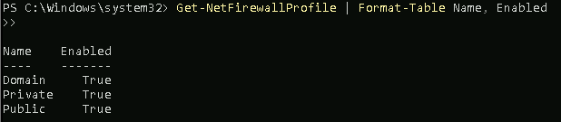


- Next, I ran PowerShell in Windows as administrator and used the command `New-NetFirewallRule -DisplayName "Allow ICMPv4-In" -Protocol ICMPv4 -IcmpType 8 -Direction Inbound -Action Allow`
	Explanation of the command:

| Flag                             | Meaning                                                                                             |
| -------------------------------- | --------------------------------------------------------------------------------------------------- |
| `New-NetFirewallRule`            | Creates a new rule in the Windows Firewall.                                                         |
| `-DisplayName "Allow ICMPv4-In"` | Sets a name so you can find/delete it later.                                                        |
| `-Protocol ICMPv4`               | Tells the firewall you're working with ICMP version 4, the protocol used by ping and similar tools. |
| `-IcmpType 8`                    | Allows Echo Requests (ICMP type 8)  this is the request part of a ping.                             |
| `-Direction Inbound`             | Applies the rule to incoming traffic.                                                               |
| `-Action Allow`                  | Tells the firewall to allow the traffic instead of blocking it.                                     |

- **This command changed the rules of the firewall in the Windows machine, allowing it to receive ping requests.**


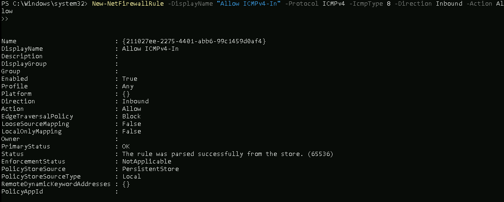


- With the new firewall rules, I tried the hping3 command again from the Linux machine:


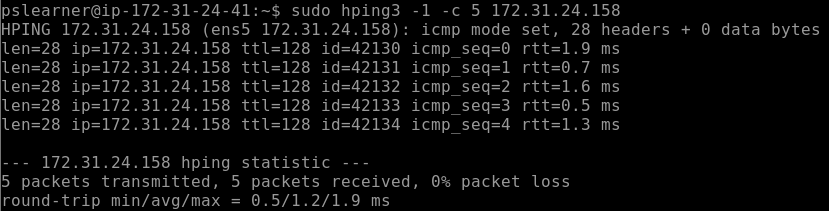


**Result: 5 packets transmitted, 5 packets received, 0% packet loss.**

### Do a port scan using hping3 from the Linux machine:

`sudo hping3 -8 1-30 IPAddressHere` performs a TCP scan of ports 1-30 on the specified IP address. It's commonly used for network troubleshooting.


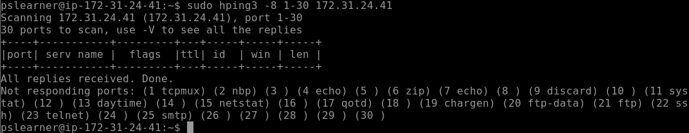


### Try different options of the Windows whoami command:

`whoami /groups`:
Shows the security groups the current user belongs to, including their security identifiers (SIDs) and attributes.


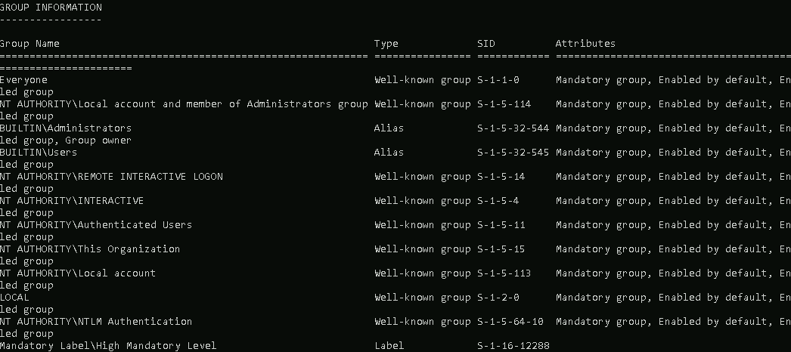


`whoami /all`:
Shows all information about the current user, including username, SIDs, privileges, groups, and security attributes.


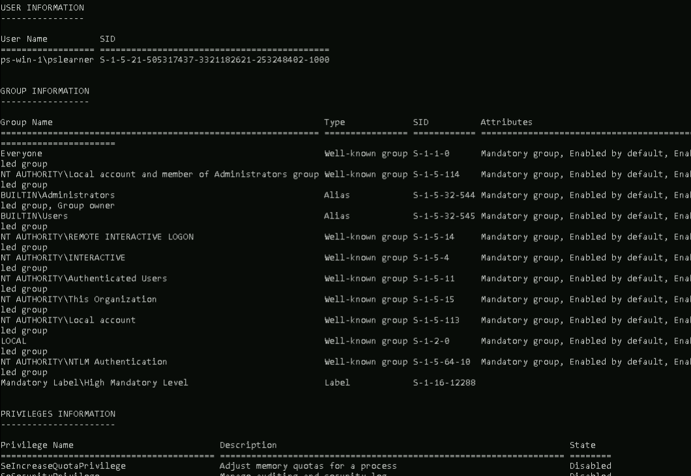
