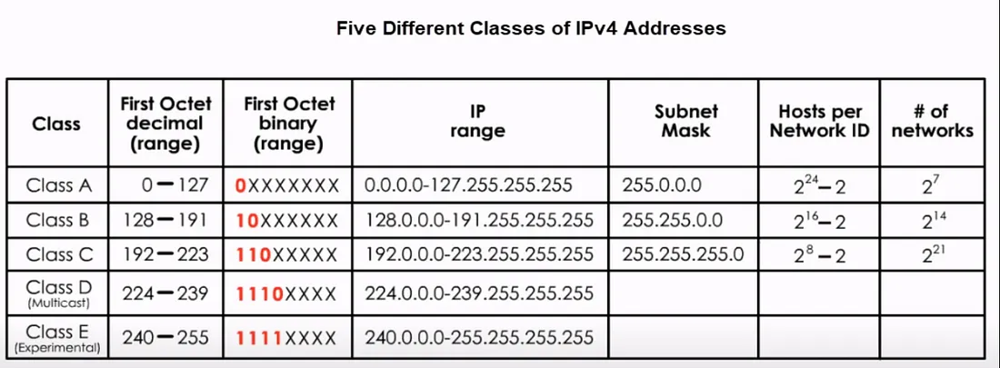

# Understanding IP Addresses

This document explains the concept of IP addresses in simple, clear language. It covers dynamic and static IPs, binary structure, host and network IDs, DHCP, IANA, PIPA, subnets, classful and classless addressing, NAT, and IPv6.

## What Is an IP Address?

An **IP address** (Internet Protocol address) is a unique string of numbers that identifies a device on a network. It works like a postal address, letting devices send and receive data.

There are two main types of IP addresses in use today:

- **IPv4** (e.g., `192.168.0.1`)
- **IPv6** (e.g., `2001:0db8:85a3:0000:0000:8a2e:0370:7334`)

## Dynamic vs. Static IP Addresses

- **Dynamic IP Address**: Assigned automatically by a server (usually a DHCP server). It can change over time.
- **Static IP Address**: Manually configured and does not change unless you change it.

Dynamic IPs are easier to manage for home networks. Static IPs are used for servers or devices that need a permanent address.

## IP Address at the Binary Level

IPv4 addresses are 32 bits long. They are usually shown in decimal form, like `192.168.1.1`, but they are actually stored as binary:

```
192.168.1.1
11000000.10101000.00000001.00000001
```

Each part (called an _octet_) is 8 bits, so 4 x 8 = 32 bits total.

## Network ID and Host ID

Every IP address has two parts:

- **Network ID**: Identifies the network.
- **Host ID**: Identifies the device (host) on that network.

The boundary between Network ID and Host ID is defined by a **subnet mask**.

## What Is a Subnet and Subnet Mask?

- A **subnet** (short for "sub-network") divides a large network into smaller, manageable parts.
- A **subnet mask** shows where the Network ID ends and the Host ID begins.

Example:

```
IP Address:     192.168.1.10
Subnet Mask:    255.255.255.0
```

The first 24 bits (255.255.255) are the Network ID. The last 8 bits (.0) are the Host ID.

## Classful Addressing

In the early days of the Internet, IP addresses were divided into **classes**:

- **Class A**: 1.0.0.0 - 127.255.255.255
- **Class B**: 128.0.0.0 - 191.255.255.255
- **Class C**: 192.0.0.0 - 223.255.255.255
- **Class D**: 224.0.0.0 - 239.255.255.255 (used for multicast)
- **Class E**: 240.0.0.0 - 255.255.255.255 (reserved)

### Why Were There Different Classes?

Each class was designed to support different network sizes:

- **Class A**: Very large networks (millions of hosts)
- **Class B**: Medium-sized networks
- **Class C**: Small networks



However, classful addressing wasted IPs, which led to classless addressing.

## Classless Addressing (CIDR)

**CIDR (Classless Inter-Domain Routing)** replaced the rigid class system. Instead of using classes, CIDR uses a format like this:

```
192.168.1.10/24
```

This means the first 24 bits are the Network ID. CIDR is flexible and efficient.


## Public vs. Private IP Addresses

- **Public IP**: Can be accessed over the Internet.
- **Private IP**: Only used inside private networks.

### Private IP Ranges:

- Class A: `10.0.0.0 - 10.255.255.255`
- Class B: `172.16.0.0 - 172.31.255.255`
- Class C: `192.168.0.0 - 192.168.255.255`

Devices on the same local network use private IPs. A router uses **Network Address Translation (NAT)** to connect them to the public Internet.

## NAT (Network Address Translation)

**NAT** allows multiple devices on a private network to share a single public IP address. It keeps your internal network hidden and adds a layer of security.

## DHCP (Dynamic Host Configuration Protocol)

**DHCP** is a protocol that automatically assigns IP addresses to devices on a network. It saves time and reduces mistakes.

When a device connects, it says: "I need an IP!" The DHCP server responds with an available one.

## IANA and APIPA

- **IANA (Internet Assigned Numbers Authority)**: Manages IP address allocation worldwide.
- **APIPA (Automatic Private IP Addressing)**: Used when a device cannot get an IP from a DHCP server. It assigns itself an IP in the `169.254.x.x` range.

## IPv6 and Hexadecimal

Due to IPv4 exhaustion, **IPv6** was created. It uses 128-bit addresses, written in hexadecimal (base 16).

Example:

```
2001:0db8:85a3:0000:0000:8a2e:0370:7334
```

Hexadecimal uses numbers 0-9 and letters A-F:

- A = 10
- B = 11
- C = 12
- D = 13    
- E = 14
- F = 15

IPv6 supports a massive number of addresses (about 3.4×10^38), solving the IP shortage.

---

## Summary Table

|Concept|Description|
|---|---|
|IP Address|Unique identifier for a device on a network|
|Static IP|Manually assigned, stays the same|
|Dynamic IP|Assigned by DHCP, can change|
|Binary|IPs are stored as 1s and 0s|
|Subnet|Smaller part of a larger network|
|Subnet Mask|Defines Network and Host ID parts of IP|
|NAT|Lets private IPs access the internet via a public IP|
|DHCP|Protocol that assigns IPs automatically|
|IANA|Manages global IP allocations|
|APIPA|Auto-IP in case DHCP fails (169.254.x.x)|
|IPv6|Modern IP version using hex and 128 bits|
