# EndeavourOS Installation on Personal Workstation

## Overview

This documentation covers the installation and setup of EndeavourOS as my main OS for personal learning, development, and cybersecurity training.  

### Why Endeavour?

I have a few reasons:
- It is built on **Arch Linux** - Which is a minimalist distribution that emphasises hands-on use of the terminal and has a steep learning curve. This will help hone my understanding over time.
- Easy to install - Arch Linux is known to be more difficult to install than other distributions, but EndeavourOS uses the Calamares installer to streamline the process with a GUI.
- Welcome App - EndeavourOS comes with a very useful welcome app which has all of the necessary links to learn everything you need.


---

## System Specs

| Component       | Model/Details                                   |
| --------------- | ----------------------------------------------- |
| CPU             | Ryzen 5 5500                                    |
| RAM             | 32GB DDR4 @ 3800MHz                             |
| GPU             | GTX 1080 Ti                                     |
| Main Drive      | 2TB Intel 670P NVMe                             |
| Secondary Drive | 2TB FireCuda SSHD (Windows Clone)               |
| Extra Drives    | 1TB HDD x2 (RAID candidates), 4TB HDD (storage) |

---

## Installation Goals

- Replace Windows as main OS with EndeavourOS.
- Have LTS (Long Term Support) kernel installed alongside the newest kernel, and use GRUB bootloader to support stable fallback in case of update incompatibilities
- Retain bootable Windows on separate drive for gaming.
- Begin Linux-focused workflow: CLI tools (Git, Nano, Flatpak) and Obsidian based markdown documentation.
- Basic OS hardening 

---

## Pre-Installation

- **Backed up all important data.**
- Used **Macrium Reflect Free** to clone Windows C:\ to 2TB SSHD.
- Downloaded EndeavourOS from the official website.
- **Verified the ISO file integrity using SHA512 checksum**:
  - Downloaded the SHA 512 checksum file from the EndeavourOS website
  - Used bash terminal in VScode to verify the checksum matches
  - 

   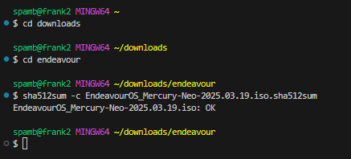


- **Created bootable USB drive to install EndeavourOS**
  - Installed Rufus tool to create bootable USB

 
	 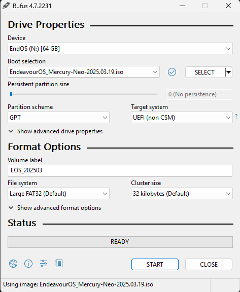


- Booted from EndeavourOS USB (Calamares installer).

	 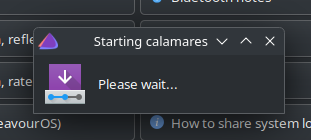

  
	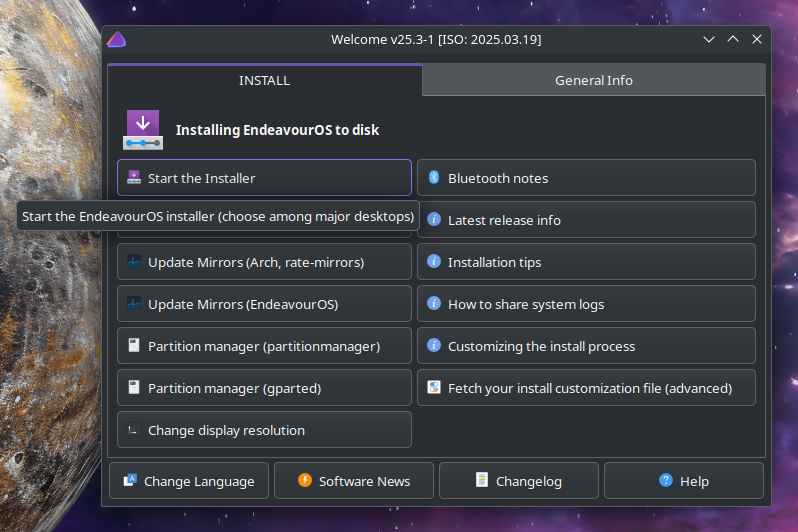

---
### Calamares Installation Process

The Calamares Installer provided with EndeavourOS has a user friendly GUI


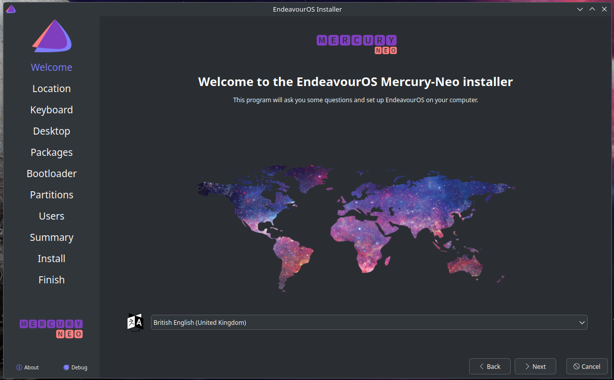


- After the welcome screen, there are GUI panels for choosing your locale and keyboard layout.
- The installer offers a wide range of desktop environments, I chose Plasma KDE for its modern aesthetic and extensive features.

  


- LTS (Long Term Support) kernel to be installed alongside the newest kernel.

  


- GRUB is selected as the bootloader which allows for a stable fallback to LTS (Long Term Support) kernel in case the newer kernel updates introduce compatibility issues with hardware or software.

  
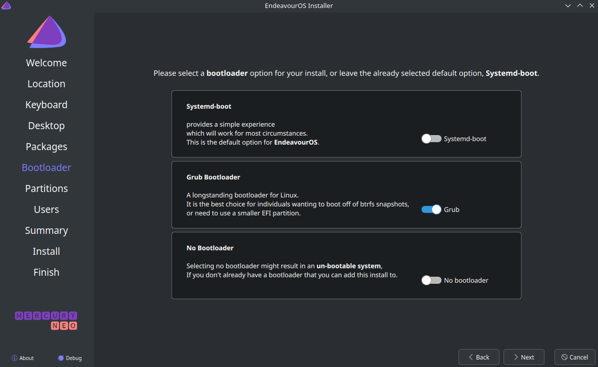


- A long list of recommended packages includes git, which was used to push this documentation to GitHub.

  


##### Planned Partition structure:

| Mount Point | Size                     | Type          | File System |
| ----------- | ------------------------ | ------------- | ----------- |
| `/boot/efi` | ~512Mb                   | Boot          | FAT32       |
| Unmounted   | ~60GiB                   | Memory Buffer | Unformated  |
| /           | Remaining space (~1.8TB) | Root          | Btrfs       |

All to be created using the installer’s guided manual partitioning tool.
- Opting for a Btrfs file system for its built-in snapshots, compression, and RAID support.

Chose Manual Partitioning option in order to create the planned structure:


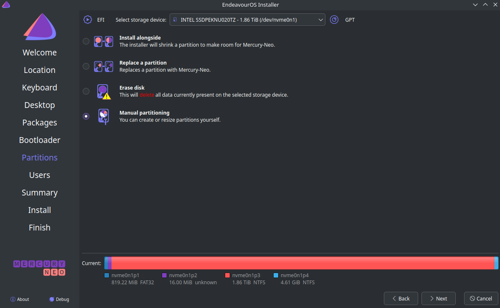


Used the installer's built in partition manager to delete all windows partitions:


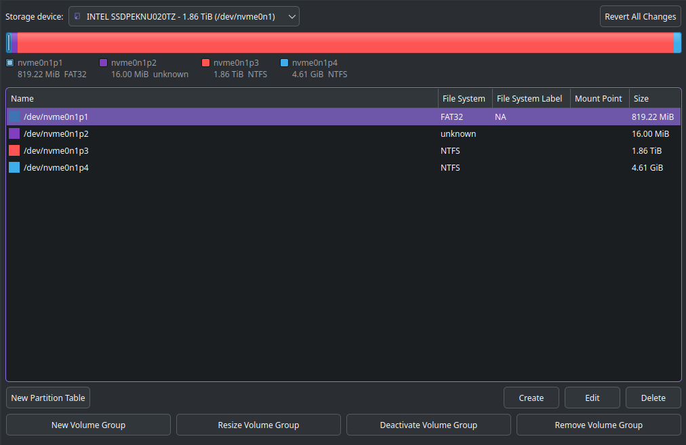


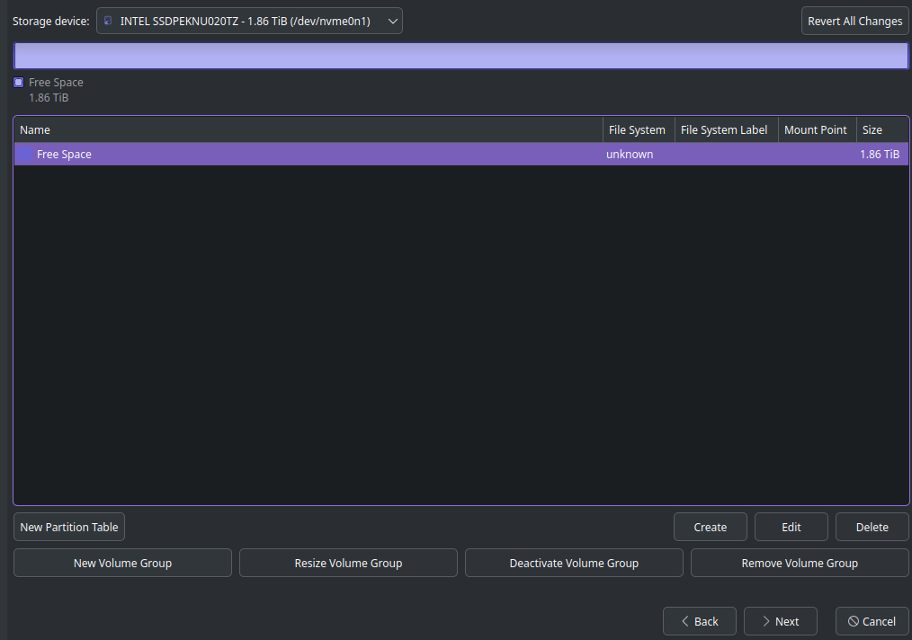


Created the required partitions:


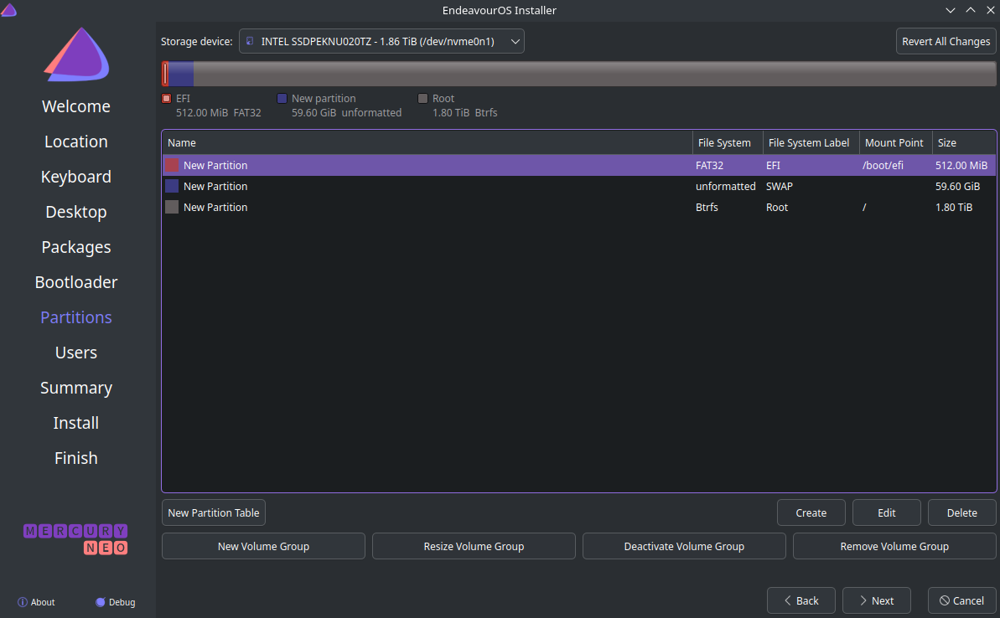


#### Installer Password Policy

- The installer has a password policy which prohibits passwords that are too short:


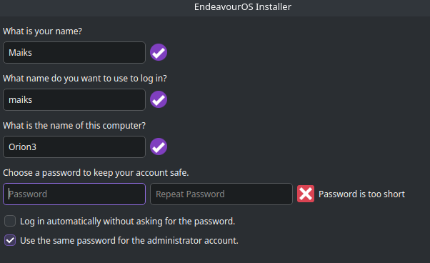


### Installer Summary:


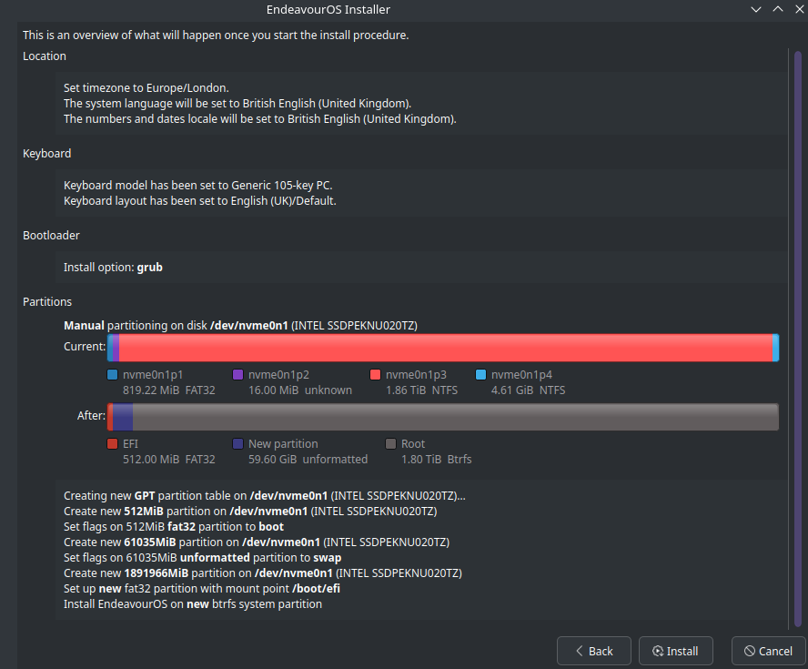


---

## Post-Install Setup

### System Updates & Mirrors
Upon booting into EndeavourOS for the first time, the post-install setup is made very straightforward with buttons that execute the relevant CLI commands in a terminal.


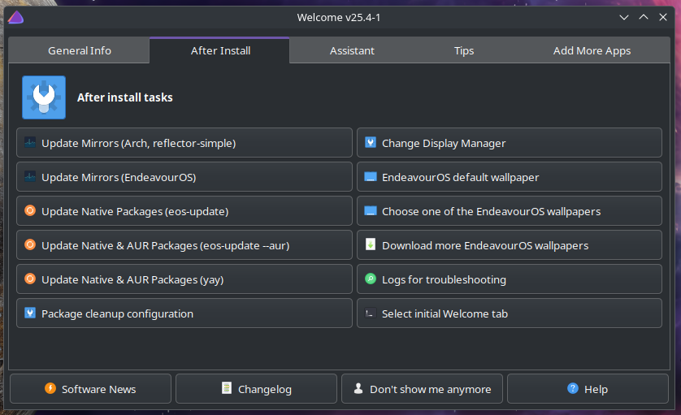


## Basic OS Hardening

### Firewall Setup
**Uncomplicated Firewall (UFW)** is a tool that helps manage firewall rules on Linux. During the EndeavourOS installation, it is included under recommended packages and checked on by default under the firewall section. UFW provides an easy way to implement basic OS hardening:
- Enabled firewall rules with `ufw`:
```bash
sudo systemctl enable --now ufw
sudo ufw default deny # Sets default firewall policy to deny all incoming connections. This reduces the attack surface by only allowing explicitly permitted services.
sudo ufw enable
```
###  Application Policy (Flatpak vs Pacman)

**Flatpak** installs applications in isolated sandboxes with limited system access, while **Pacman** installs them system-wide with full integration and permissions. 

As part of basic OS hardening, I’ve adopted a policy of **sandboxing any closed source or network facing applications where possible**. This strategy reduces the risk of a compromised app impacting the system.

#### Pacman

- Used for **system tools**, **CLI utilities**, and **trusted, open-source, and offline** software.
    
- Installs software **system-wide** with full access unless manually and explicitly restricted.
    
- Preferred when performance or system integration is vital.
    

#### Flatpak

- Used for **network-facing**, **closed-source**, or **higher-risk** applications.
    
- Runs apps in an **isolated sandbox** with limited system access.
    
- Helps enforce a “least privilege” model by default.
    

#### Why this matters:

Even well-maintained apps like browsers and communication tools are major attack surfaces. Running them in containers helps limit potential damage from zero-day vulnerabilities or malicious content.

> **Flatpak is being used for apps like Brave, Discord, Zoom, and WhatsApp to isolate them from the core system.** Pacman is used for packages that require close integration or trusted access.


---

## Planned Projects From Here

- RAID Setup (1TB HDDs in RAID 1 or 0 for hands-on practice + portfolio docs)
- Further OS Hardening (SSH hardening, Kernel hardening, AIDE file integrity monitoring)
- Install Ableton using Wine

---

## Notes & Reflections

- The EndeavourOS installer made Arch incredibly accessible with a very quick GUI based install and few post-install frustrations.
- Windows does not boot well from the clone, the hard drive usage is always 100% and the GUI itself takes minutes to load. 
	- Plan to game on that drive -> Just a backup for the old files
		- 100% usage all the time suggests not the best drive health, will look into RAID backups for redundancy
	- Plan to game on that drive -> Look into proton, lutris, and bottles to game on my linux machine

- This setup reflects my goals of becoming Linux-proficient and security-aware, while maintaining usability for creative work, larger projects, and general use.

---
## Status: Installed & Working
This was uploaded to Git using CLI on EndeavourOS
