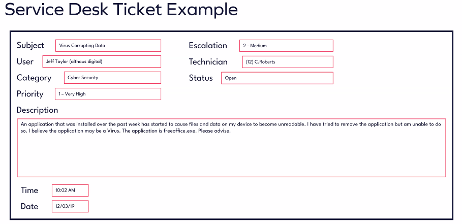

# Service Desks & Ticketing Systems 

## Service Desk

A service desk is a point of contact between the service provider and the users.
Service desks offer more than just IT support.

- Manages incidents, service requests, and stakeholder communications
- Supports both internal and external users
- Offers various services including:
    - Cyber Security
    - IT Support
    - Application Consultation
- Typically overseen by a service desk manager
- Operated by a team of technical specialists with diverse knowledge and skills

### Service Desk Delivery
#### Core Principles

- Must operate efficiently in both service delivery and customer communication
- Request prioritisation should be based on the significance of customer issues
- High-priority requests should receive appropriate attention and resources
- **Process Optimisation**
	- Standardised procedures improve response time and consistency
		- A service desk should have defined processes for common issues (e.g., password resets, known bugs with tools)
	
- **Customer Consideration**
	- Maintain awareness of the organisation's brand perception among customers
	- Account for cultural diversity and accessibility needs
	- Adapt communication based on customers' technical knowledge levels
	- Consider the customer's profile and position within their business context

---

## Ticketing Systems

Ticketing systems are tools used to manage support requests. They track the progress and resolution of issues submitted by users. Ticketing systems streamline the support process by providing a centralised platform for logging, prioritising, assigning, and tracking user issues.

**Key features:**
- Unique ticket numbers
- Categorisation and prioritisation
- Automated notifications
- Performance analytics
- Ticket tracking
- Communication tools

Examples: Jira, Zendesk, Freshdesk, ServiceNow,  Microsoft Dynamics 365 Customer Service

### Ticket Statuses
- Open - Ticket has been created and needs to be actioned
- Pending - A ticket had been logged but further information is required from the end user 
- Resolved - Resolved and waiting on end users confirmation 
- Closed - Confirmed by the end user to be resolved 
### Ticket Priority 
1 -  Urgent
2 -  High
3 -  Medium
4 -  Low
#### Why a ticket might get rejected/cancelled

- Duplicate tickets for the same issue
- Requests outside the scope of IT support services
- Submissions to the wrong department or support team
- Requests that violate company policies or security protocols
- Unauthorised software or hardware installation requests
- Changes in business priorities or project cancellations
- Consolidation of multiple tickets into a single request
### Benefits of Ticketing Systems 
#### Efficiency

- Streamlines support workflows and reduces response times
- Minimises manual tasks through automation
- Enables faster issue resolution with organised request handling
#### Visibility

- Provides clear status tracking for all user requests
- Enables better prioritisation based on urgency and impact
- Allows for optimal resource allocation and workload management
#### Documentation

- Creates comprehensive records of troubleshooting steps and solutions
- Builds a searchable knowledge base for future reference
- Supports trend analysis to identify recurring issues
#### Accountability

- Assigns clear ownership of tickets to specific technicians
- Tracks resolution progress through the entire lifecycle
- Creates measurable performance metrics for keeping track of whether or not technicians are meeting operational level agreements (OLAs)
#### Customer Satisfaction

- Delivers timely communication
- Ensures consistent adherence to service level agreements (SLAs)
- Builds trust through reliable issue resolution and follow-up

### Ticket Lifecycle 
#### Creation
- User submits request with contact details, how many people are affected (one or many), issue description, and priority, category of tickets
- System generates unique ticket identifier
- Depending on the system used, a user can create the ticket themselves or speak to a technician who manually raises the ticket or the user might be able to put forward a ticket request
#### Assignment
- Ticket routed to appropriate technician based on urgency, impact, and priority
- Resources allocated according to ticket classification
#### Troubleshooting
- Technician investigates issue and performs diagnostic steps
- User contacted for additional information when necessary
- Progress updates documented in ticket history
#### Resolution
- Solution implemented and verified
- Resolution details recorded
- User notified of completed action
#### Closure
- Ticket closed after user confirmation of satisfaction
- Troubleshooting steps and solution documented for knowledge base
- Metrics captured for reporting and service improvement
- Automatically closed if no response from customer after resolution for 24/48hr

## Service Desk Ticket Example

- **Subject:**  
    A brief summary of the issue reported.  
    → "Virus Corrupting Data" indicates a suspected malware issue affecting files.
    
- **User:**  
    The name and department or company of the person reporting the issue.  
    → Jeff Taylor from "althaus digital."
    
- **Category:**  
    The classification of the issue type.  
    → "Cyber Security" suggests the problem is security-related.
    
- **Priority:**  
    The urgency and impact level of the issue.  
    → "1 - Very High" means it’s critical and likely affecting key functions or data.
    
- **Description:**  
    Detailed explanation of the issue from the user’s perspective.  
    → Describes a suspected virus (freeoffice.exe) causing file corruption; removal attempts failed.
    
- **Time:**  
    When the ticket was submitted or the issue was logged.  
    → Logged at 10:02 AM.
    
- **Date:**  
    The specific date the issue was reported.  
    → Logged on 12/03/19.
    
- **Escalation:**  
    Indicates the level of escalation required.  
    → "2 - Medium" suggests it needs attention from higher support but isn’t the top priority yet.
    
- **Technician:**  
    The person assigned to handle the issue. Ensures accountability 
    → C. Roberts (Technician ID 12).
    
- **Status:**  
    Current progress of the ticket.  
    → "Open" means it is still active and unresolved.

### Composing Accurate Tickets 

**Accurate and detailed ticket documentation is essential for efficient problem resolution and knowledge sharing within the IT support team.**

Well-documented tickets help technicians:
- Understand the issue context
- Identify potential solutions
- Track progress toward resolution

#### Required Information for Support Tickets:

- User Information
- Issue Description
- Steps to Reproduce
- Impact
- Priority
##### Composing Tickets Best Practise: 

- Avoid technical jargon and use language that is easily understandable to both technical and non-technical stakeholders.

- Provide specific details, such as software versions, hardware configurations, and timestamps.

- Attach screenshots, log files, or any other relevant documents that can help in diagnosing and resolving the issue.

- Punctually update the ticket status to reflect progress.

- Follow standardised templates for documenting support requests to ensure consistency across tickets.

- Take time to gather all necessary information and document the ticket comprehensively to minimise back-and-forth communication and delays.

- Double-check the accuracy and completeness of the ticket information.

##### Ticket Prioritisation
The process of categorising support tickets based on their **urgency**, **impact**, and **business priority** to ensure efficient issue resolution.
##### Key Factors in Ticket Prioritisation

- **Impact:**  
    Evaluates how the issue affects business operations.  
    - High-impact issues affect multiple users or critical systems.
    - Low-impact issues affect a single user or non-critical systems.
    
- **Urgency:**  
    Assesses how time-sensitive the issue is.  
    - Influenced by deadlines, service level agreements (SLAs), or critical system requirements.
    
- **Business Priority:**  
    Considers how the issue aligns with business goals.  
    - Issues affecting revenue streams are prioritised higher.

- **Priority Classification System:**  
    Use a standard system (e.g., _Low, Medium, High, Critical_) to categorise tickets based on severity and impact.
    
- **Service Level Agreements (SLAs):**  
    SLAs should include clearly defined response and resolution times for each priority level to ensure timely handling of issues.
    
- **Resource Optimisation:**  
    Allocate resources effectively by addressing high-priority issues first—those with the most significant impact on operations.

## Ticket Escalation Management

The SLA (Service Level Agreement) and OLA (Operational Level Agreement) set the rules for when to escalate a ticket. The SLA is the agreement with the customer, while the OLA is the agreement within the support team. Together they define the procedure for when ticket escalations should happen.

- **1st Line Support**
    - When: Initial contact point for all tickets
    - Why: Resolve common issues quickly and filter more complex problems
- **2nd Line Support**
    - When: Issue requires technical expertise beyond basic troubleshooting
    - Why: Apply deeper technical knowledge to resolve intermediate problems
- **3rd Line/Specialist Support**
    - When: Complex issues affecting specific systems or requiring specialised knowledge
    - Why: Leverage expert-level skills for advanced technical problems
- **4th Line/Service Management**
    - When: Major incidents, persistent issues affecting business operations, or Issues with third-party products requiring proprietary access.
    - Why: Access external expertise and resources that are not internally available
