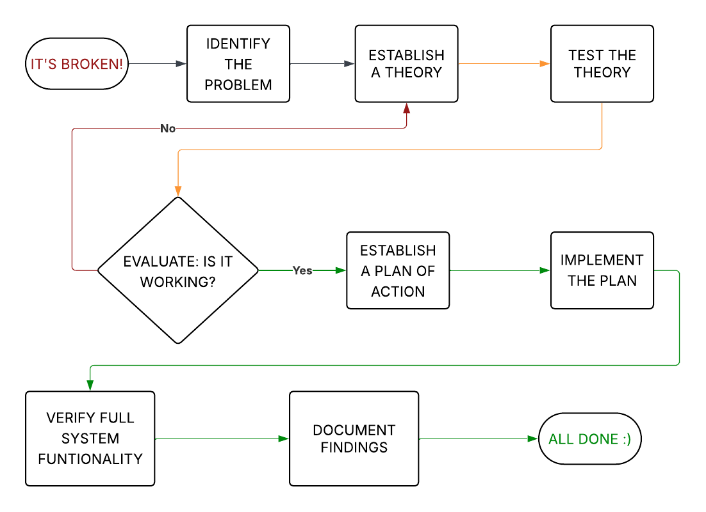

# Troubleshooting Methodology

Troubleshooting is the process of diagnosing and resolving a technical issue using a structured and logical approach. The goal is not only to solve the problem but to also learn from each case so that reoccurring problems can be avoided or easily fixed again in the future.

---

## Structured Approach to Troubleshooting a Problem

### 1. **Problem Starts**

An issue becomes apparent. A system, device, or application is not functioning as expected. This is where your work begins.

- Users may report unexpected behaviour.
- Automated monitoring tools might flag errors or anomalies.
- Symptoms might be obvious or subtle.

---

### 2. **Identify the Problem**

Begin gathering data, collect as many facts as possible.
#### Ask these questions:

- Is the physicality of the device as it should be?
- What is not working as expected?
- What _should_ be happening?
- When did it last work correctly?
- Has anything changed recently (hardware, software, environment)?
- Is the problem consistent or intermittent?
- Is the issue isolated to one user, device, or system, or is it widespread?

#### Actions:

- Replicate the issue if possible.
- Check logs, alerts, or event viewer data.
- Question users - They're the best source of details
- Observe behaviour firsthand.

> **Important:** Before making any changes, **back up important data** and create a **rollback plan**.

---

### 3. **Establish a Theory of the Cause**

Form hypotheses based on the information collected.

Examples:
1. The screen is blank when powered on, therefore the monitor connection or graphics card might be loose.
    
2. The keyboard isn't responding, therefore it might need to be reconnected or have driver issues.
    
3. The application crashes repeatedly, therefore it might need to be reinstalled or updated.

Consider the most likely causes first:

- User error
- Software misconfiguration
- Faulty update
- Hardware failure
- Network issues
- Security breaches or permission problems

> Base your theory on evidence, not assumptions. Rule out obvious issues first (e.g., is the device plugged in?).

---

### 4. **Test the Theory**

Try a safe action that would validate or invalidate your theory.
#### Examples:

- Check if the cable is properly plugged in.
- Reboot the device or application.
- Swap out cables or peripherals.
- Revert a recent setting or update.
- Test with a different user account.
- Temporarily disable a security feature.

> A good test isolates variables. Don’t test too many things at once.
> For example, if a monitor was periodically cutting out for a second and showing a black screen, and you've replaced the video cable, swapped monitors, and updated the graphics drivers before testing any of those theories, you wont be able to make proper documentation and contribute to the knowledge base because it's impossible to know what change actually solved the problem.

---

### 5. **Evaluate the Results**

Check whether your test resolved the issue.

- **If successful**: You’ve likely found the root cause.
- **If not**: Re-examine your assumptions. Create a new theory and test again.

> Troubleshooting is iterative. You may loop through this step several times.

---

### 6. **Establish a Plan of Action**

Once you’ve confirmed the cause, design a fix that solves the root of the issue, not just the symptoms.

#### Consider:

- Is the fix permanent or temporary?
- Will it impact other systems or users?
- Does it require downtime or user communication?

Plan your steps carefully and consider contingencies.

---

### 7. **Implement the Plan**

Carry out your fix.

- Schedule downtime if necessary.
- Inform affected users.
- Follow best practices and safety protocols.
- Monitor as you apply changes.

---

### 8. **Verify Full System Functionality**

Ensure that everything is working, not just the specific symptom you were focused on.

- Are related systems or features functioning?
- Has the user confirmed the issue is resolved?
- Is performance normal?
- Can the user carry on their work as normal?

---

### 9. **Document the Findings**

Write down what happened, what caused it, and how you fixed it.

#### Include:

- The symptoms and affected systems.
- Your diagnosis and testing process.
- The final resolution.
- Any lessons learned or recommendations for prevention.

> Documentation builds team knowledge and helps resolve future issues faster.

---

### 10. **All Done**

Follow up with users after some time to ensure the issue has not resurfaced.

> Good troubleshooting ends with peace of mind for all involved.

---

## Summary

Troubleshooting is both art and science. You:

- **Observe** the problem
- **Theorise** about causes
- **Test** those theories
- **Resolve** the issue
- **Confirm** it's fixed
- **Document** your work

This approach minimises risk, ensures consistency, and builds a knowledge base for more efficient troubleshooting in the future.

---

## Software Troubleshooting Tools

These tools help analyse, repair, and monitor software environments.

- **Command Line Interface (CLI)**  
    Tools like `ping`, `tracert`, `ipconfig/ifconfig`, `netstat`, `nslookup`, `top/htop`, `tasklist`, and `chkdsk` help diagnose connectivity, performance, and system health issues.

- **Event Viewer (Windows)**  
    Logs system events, errors, warnings, and audit messages.

- **Task Manager / Activity Monitor**  
    Shows real-time resource usage and running processes.

- **System Logs (Linux/macOS)**  
    View `/var/log/syslog`, `/var/log/dmesg`, or journalctl for hardware and kernel issues.

- **Safe Mode / Clean Boot**  
    Starts the system with minimal drivers/services to isolate issues.

- **System Restore / Rollback Utilities**  
    Restore systems to a previous known-good configuration.

---

## Physical Hardware Troubleshooting Tools

Use these tools to diagnose and test physical hardware components:

- **Multimeter**  
    Measures voltage, current, and resistance. Useful for testing power supplies, continuity, and basic circuit function.
    
- **Infrared (IR) Camera / Thermal Gun**  
    Detects overheating components or poor thermal contact.
    
- **Power Supply Unit (PSU) Tester**  
    Tests voltage output and ensures power delivery is stable and within spec.
    
- **HDD / SSD Diagnostic Tools**  
    Tools like CrystalDiskInfo, smartctl (Linux), or manufacturer-specific utilities test drive health and detect bad sectors.
    
- **RAM Tester**  
    Utilities like MemTest86 scan memory modules for faults and instability.
    
- **POST Card / Motherboard Diagnostic LEDs**  
    Displays error codes during Power-On Self-Test. Useful for identifying failed components before OS loads.
    
- **Loopback Plugs**  
    Simulate network connections to test ports and NICs.

---

## Troubleshooting Example

#### Initial Problem Identification

- **Issue**: User reports flickering screen
- **Technician Response**: Begin data gathering process
- **Knowledge Base Review**: Previous similar issues resolved by:
    - Properly connecting cables
    - Updating graphics drivers

##### Iteration 1

- **Hypothesis**: Video cable may be loose
- **Test**: Check cable connections at both video card and monitor
- **Evaluation**: Issue persists → Hypothesis incorrect

##### Iteration 2

- **Hypothesis**: Graphics driver may be outdated
- **Test**: Check for and install driver updates, restart computer
- **Evaluation**: Issue persists → Hypothesis incorrect

##### Iteration 3

- **Hypothesis**: Video cable may be faulty
- **Test**: Replace video cable with known working cable
- **Evaluation**: Issue persists → Hypothesis incorrect

##### Iteration 4

- **Hypothesis**: Monitor may be faulty
- **Test**: Replace monitor with spare unit
- **Evaluation**: Issue resolved → Hypothesis confirmed

#### Resolution Implementation

- **Establish Plan**: Permanently replace faulty monitor
- **Implement Plan**: Install spare monitor as permanent replacement
- **Verify Full Functionality**: Confirm screen functions properly without flickering, and no new issues have arisen.
- **User Satisfaction**: Confirm user can resume work without issues

#### Documentation

- **Symptoms**: Flickering screen affecting user productivity
- **Affected Systems**: Workstation display system
- **Diagnosis Process**: Systematic elimination of potential causes
- **Resolution**: Monitor replacement
- **Lessons Learned**:
    - Maintain inventory of spare monitors for quick replacement
    - Implement regular graphics driver update schedule to streamline future troubleshooting

#### Ticket Closed

---
